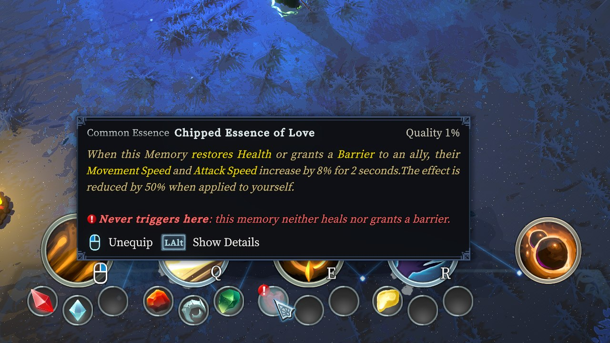
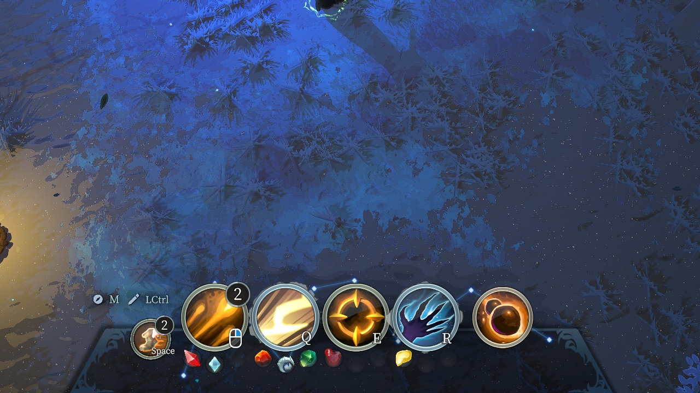
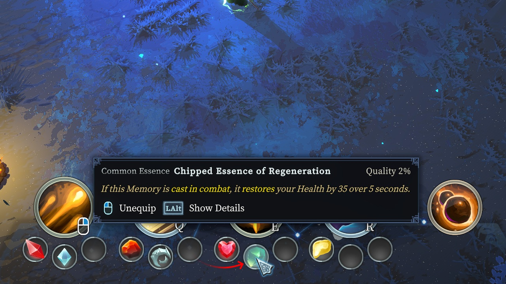
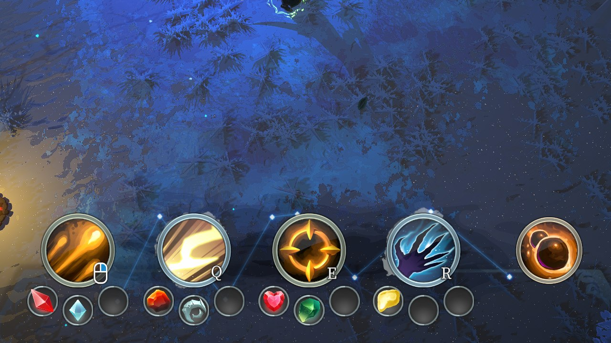

# AreMyGemsCompatible



*Essence of Love in a memory that neither heals nor grants a barrier: the icon faded to a quarter,
the mark on it, and the reason under the essence's own description.*

Warns about an essence that can never fire in the memory it is socketed into — a Q/W/E/R memory,
an identity memory given a slot by a Corrupted Chaos shrine, or a Movement memory given one by
another mod. Wholly client-side: nothing here touches an actor, a stat or a network message.

The question has two halves that are answered by completely different means, and keeping them apart
is most of the design. **Everything about an essence is read from its code** — what it waits for,
and what it hands to the memory it sits in — because an essence has code and that code is exact.
**What a memory does is read from the game's own English data dump**, because a memory has almost
no code: its behaviour lives in a prefab.

The line between them was not drawn on the first attempt. Essence descriptions were used for one
small part of the second question, and the section **An essence's description cannot answer this**
is the account of why that had to go: a description covers the essence entire, damage *taken* and
stat bonuses and amplifications included, and no vocabulary separates those from the thing itself.

## What an essence waits for

An essence reaches its memory through `Gem.OnEquipSkill`, which subscribes four of `Gem`'s own
virtuals to that memory's events:

```csharp
newSkill.TriggerEvent_OnCastComplete              += OnCastComplete;
newSkill.TriggerEvent_OnCastCompleteBeforePrepare += OnCastCompleteBeforePrepare;
newSkill.ActorEvent_OnDealDamage                  += OnDealDamage;
newSkill.ActorEvent_OnDoHeal                      += OnDoHeal;
```

[planned.md](planned.md) said those four were the whole slot-scoped vocabulary. **They are not, and
the mod would have found roughly a third of what it finds if they had been.** The claim is true
about *virtuals* — `Gem` declares no other overridable hook a slot can starve — but essences do not
limit themselves to virtuals. Thirty-three of the ninety-five shipped essences override
`OnEquipSkill` themselves and reach for the memory directly:

| what an override subscribes to | essences | starves when the memory |
| --- | --- | --- |
| `dealtDamageProcessor` | 15 | never deals damage |
| `dealtHealProcessor` | 5 | never heals |
| `dealtShieldProcessor`, `ActorEvent_OnGiveShield` | 2 | never grants a barrier |
| `TrackKills` | 2 | never kills, which needs damage |
| `AddSkillBonus`, `TriggerEvent_OnCastStart`, `SetCharge`, `LockCooldown` | — | is never cast — an identity |
| `configs`, `abilityIndex`, `specialOverlayColor`, `ClientTriggerEvent_*` | — | never — treated as always applying |

The counts in the first rows were taken when the game shipped ninety-five essences; the rows that
follow were split later, when identity memories became socketable (see **Identity and Movement
memories**), and are not counted separately.

The three `DataProcessorGroup` fields behave exactly like the events for this purpose:
`Actor.ProcessDealtDamage` walks the same `parentActor` chain the events do, so a processor added
to a memory sees everything that memory's projectiles do and nothing else.

Reading which of those an essence uses cannot be done from method names, so `GemTriggers` reads the
IL of `OnEquipSkill` and `OnEquipGem` through Harmony's `PatchProcessor.ReadMethodBody`, which
hands back each operand already resolved to a `FieldInfo` or a `MethodBase`. The member names a
method touches are then simply the operand names. Calls to the essence's own methods are followed
one level deeper, so that an override calling a private helper does not read as empty.

It is reflection over the live type rather than a table, so **an essence added by another mod is
classified the same way as a shipped one**.

### The three ways an essence escapes the verdict

Getting this wrong in the loud direction is worse than saying nothing, so each of these silences
the essence entirely:

- **A cast hook — in a memory that is cast.** Every Q/W/E/R and Movement memory raises both cast
  events, so anything built on `OnCastComplete` or `OnCastCompleteBeforePrepare` is live there.
  This was the first bullet of this list as an unconditional escape, and it stopped being one when
  identity memories took essences: they are never cast. It is now a fourth thing an essence can
  wait for, `SlotNeed.Cast`, which every memory but an identity supplies.
- **A hook on the hero.** `Gem_E_Twilight` subscribes to
  `newOwner.EntityEvent_OnAttackFiredBeforePrepare` in `OnEquipGem` *and* overrides `OnDealDamage`.
  Half of it ignores the slot, so the worst a memory can do to it is halve it.
- **`enableStatBonus`.** This is prefab data, not code, and it is the reason the classification has
  to happen against a live `Gem` rather than against a `Type`. `Gem_E_Might` reads as nothing but a
  damage amplifier until you notice the flat Maximum Health it grants through `Gem.OnEquipGem`;
  `Gem_E_Apathy` is the same shape. Both would otherwise be warned about wrongly.

**An override of `OnEquipGem` is read rather than counted**, which is a distinction worth the code.
`Gem_C_Confidence` and `Gem_R_Accuracy` override it only to play an aura effect and are otherwise
pure damage-triggered essences that a memory dealing no damage really does silence. Counting the
override would have lost both.

An `OnEquipSkill` override that reaches for something on neither list is doing something the mod
does not understand, and unknown is not the same as dead: it silences the essence too.

## What a memory does

`SkillTrigger` subclasses are nearly empty. `St_C_IceBlock` declares nothing but Mirror's generated
stub, and `St_C_Starfall` declares only a range check. A memory's behaviour lives in its prefab, in
the `AbilityInstance` prefabs its `TriggerConfig.spawnedInstanceRef` points at — so **there is
nothing in a memory's code to analyse**, and following the prefab graph means deciding, from the IL
of every `Ai_` type a memory can reach, whether any of them ever calls `Actor.DealDamage`.

The game makes that unnecessary. `RawData\<language>\` carries a full dump of every memory and
essence — description, the scaling variables behind each number by their authored field names,
rarity, tags, and which slot a hero memory belongs to — and the `Readme.txt` beside it says plainly
that it is there for wikis and community tooling. `memories.json` answers the question by reading
what the memory says it does.

`essences.json` sits beside it, describes essences just as fully, and **is never opened**. That is
the one asymmetry in the mod and it is deliberate: prose is the only source there is for a memory,
and the worst source there is for an essence.

### English, and only English

**Only `RawData\en-US` is ever read, whatever language the game is being played in.** The answers
come out of prose, and prose is what a translation changes: every locale would need its own
vocabulary for damage, healing and barriers, would need it re-checked on every patch, and would be
silently wrong in whichever languages nobody tested. English is the language the values were
authored in and the one the field names are in. The player's language decides only what the warning
says.

### The three questions, and where each one nearly went wrong

Each is asked of two things: the description with its rich text stripped, and the `raw` field names
from `rawDescVars` joined together. Either matching is enough.

| | prose | field names |
| --- | --- | --- |
| damage | `\bdamage\b` | `dmg`, `damage` |
| heal | `\bheal(s\|ed\|ing)?\b`, `lifesteal`, `regenerat`, `(restor\|recover)…health` | `heal(?!th)` |
| shield | `\bbarrier\b`, `\bshield(s\|ed\|ing)?\b` | `shield`, `barrier` |

The word boundaries are the whole trick and both directions cost something:

- **`heal` without a boundary matches "maximum health"**, and every damage memory in the game
  becomes a healer. `St_E_FinalExplosion` — "sacrifice X of my maximum health" — is the plain case.
- **The boundary alone is not enough either**, because the game says "restores Health" and
  "recovers Health" without ever using the word. `St_C_Purgatory` and
  `St_R_UnbreakableDetermination` both heal and neither says so.
- **On the field-name side the boundary cannot be used at all**: `healAmount` and
  `healLostHealthRatio` are both real. `heal(?!th)` matches those and rejects `summonHealth`,
  which is `St_Q_SylvanCall`'s summon durability and not healing.

Tags were considered as a second opinion and are not one. `St_C_BackStep` is tagged
`HardCC`/`Mobility` and deals damage; tags say what a thing *is*, not what it *does*.

A memory the dump does not describe — one from a later patch, or from another mod — is unknown, not
inert, and nothing is said about it.

### Auditing the three, in the direction that matters

A memory wrongly read as *doing* something costs a warning that was due — quiet, and tolerable. A
memory wrongly read as *not* doing it is a loud warning that is simply false, so each question was
audited that way round, by finding every memory the regex rejects that uses vocabulary anywhere
near the thing:

- **Damage.** Only fourteen memories are rejected, so all fourteen were read. None deals damage;
  eight are Movement memories, which could hold no essence then and were audited again against
  their code once they could — see **Identity and Movement memories**.
- **Healing.** Nine rejected memories mention Health, life, recovery, draining or absorption.
  `St_R_UnbreakableDetermination` was the one real miss — "recovers Health", a word the prose
  pattern lacks — and the variable behind it is `healLostHealthRatio`, so the field-name half
  catches it. The rest use Health as a damage scale (`St_E_JusticeGuillotine`), as a cost
  (`St_R_Immolation`), or grant a Barrier rather than healing (`St_C_GlacialStomp`).
- **Barriers.** Nine rejected memories say Invulnerable, Armor or immunity. **None of them grants a
  Barrier**, which is the only thing `dealtShieldProcessor` and `Actor.GiveShield` are about —
  invulnerability and armour are separate systems that never raise it. No misses.

## What the two halves add up to

The figures below are for the Q/W/E/R memories alone, as the game ships them at the time of
writing: 105 essences and 128 such memories. Twenty-seven of the essences wait on nothing but
damage, healing or a barrier, and that is **341 warned pairs out of 3456, about one in ten**:

| essence | waits for | dead in |
| --- | --- | --- |
| `Gem_C_Guidance` | healing | 102 of 128 |
| `Gem_C_Love` | healing or a barrier | 89 |
| twenty-four others | damage | 6 each |
| `Gem_R_Ricochet` | damage or healing | 6 |

The shape of that is the point. The **damage** essences are the ones the name of the mod suggests
and they are nearly always fine: only a handful of memories a player can socket into deal no damage
at all — `St_C_MassProtection`, `St_C_Sneeze`, `St_R_NaturesWhisper`, `St_R_Somersault`,
`St_R_Tranquility` among them. The mod earns its place on the **healing** essences, which are dead
in four memories out of five and which nothing in the game warns you about.

Identity and Movement memories change the picture enough to have their own section below.



*Which is to say the mod is silent most of the time, and is meant to be. Nine essences here and
nothing to report — the loud version of this, marking everything that is merely weaker in its
memory, would put a badge on half the bar and be worth nothing.*

## The one way a memory does more than its description says

The three `Gem.Create*WithSource` helpers are each a one-line wrapper —
`CreateStatusEffectWithSource(source, …)` is `source.CreateStatusEffect(…)` — so the source becomes
the created actor's `parentActor`, and `Actor.InvokeOnDealDamage` walks that chain. Pass the cast's
own `AbilityInstance` and whatever you create is recorded as the *memory's* doing.

So an essence firing on every cast can hand its memory a capability the memory's own description
never claims. `Gem_C_Sharp` fires arrows from `info.instance`; put it in a memory that deals no
damage and the damage-triggered essence beside it works. `Gem_C_Regeneration` does the same with
healing, which matters more: it and `Gem_C_Guidance` are both common healing essences and pairing
them is an obvious thing to try.



*The essence that does it. It is not a healing memory that saves Love here — the memory heals
nothing on its own — it is this, moving into the slot beside it.*



*And the result. `Gem_C_Regeneration` creates its heal-over-time from the cast's own
`AbilityInstance`, so the memory heals after all, Love fires, and the mark and the fade are both
withdrawn.*

`Verdict.SuppliedBySiblings` handles it. It reads the memory's owner rather than the essence's, so
the answer is the same whether the essence is socketed or is being dragged over the slot — in which
case it has no owner yet.

### An essence's description cannot answer this, and the attempt is instructive

The first version asked only whether a sibling was always live and whether its English description
mentioned the capability. It was wrong within minutes of play. `Gem_E_Overload`:

```csharp
info.instance.dealtDamageProcessor.Add(AmpDamage);
info.instance.dealtHealProcessor.Add(AmpHeal);
```

It reaches for the cast and its description talks about damage and healing — but it only
*amplifies* what the memory already does, and an amplifier applied to nothing yields nothing.
Socketing it silently cleared the warning off `Gem_C_Guidance` and `Gem_C_Love` in a memory that
still healed for exactly zero. A warning that appears and then vanishes for an unrelated reason is
worse than either error alone: it makes every other verdict look arbitrary.

Reading all ninety-three shipped essence descriptions afterwards settles the question rather than
patching it. A description covers the essence entire, and the same three words carry at least four
unrelated meanings:

| what it says | what it is |
| --- | --- |
| `Gem_E_Protection` — "reducing **damage** taken" | damage *received*, not dealt |
| `Gem_R_Insatiable` — "Attack **Damage** is increased" | a stat bonus |
| `Gem_E_Overload` — "the **damage** and **healing** … are increased" | amplification of someone else's |
| `Gem_C_Sharp` — "arrows that deal **damage**" | the thing itself |

Only the last is a supply, and no vocabulary separates them. **So the essence side reads no prose
at all**, and `essences.json` is not opened. What an essence supplies is read out of its code in
two steps.

### Step one: does it create through the cast?

The essence's own code has to both call one of the three `Gem.Create*WithSource` helpers and reach
for `EventInfoCast.instance`. Both halves are asked of the whole type rather than of the call site,
deliberately, because the source is rarely written at the call: `Gem_L_SolarEye` copies it into a
local first, `Gem_U_LastStarlight` creates against itself and then assigns
`_instance.parentActor = info.instance`, and several put the call inside a lambda. Asking whether
the type does both answers all three shapes without tracing an argument back to where it came from.

That alone excludes `Gem_E_Overload`, `Gem_R_Rejuvenation`, `Gem_R_Composure`, `Gem_C_Quicksilver`
and `Gem_R_Epiphany`, which create against themselves or create nothing. `Gem_R_Rejuvenation` is
the instructive near-miss: it does heal, and says so, but through `Gem.Heal(...).Dispatch(...)`
with the essence as the healing actor, so the memory's `dealtHealProcessor` never fires.

### Step two: what do the created things do?

Their types come free — they are the generic arguments of the very calls found in step one — and
each is walked for `DealDamage`, `DoHeal`, `GiveShield`, or a `Dispatch` on `DamageData` or
`HealData`, following whatever it creates in turn up to three hops.

**The answer is usually in a base class, not in the type itself.** `Ai_E_Aftershock_Damage` and
`Ai_Gem_R_Scorched_Meteor` declare nothing but an `OnHit` and a little movement; both derive from
`InstantDamageInstance`, and it is the abstract `DamageInstance` above that which ends in
`dmg.Dispatch(entity, chain)`. Reading only a type's own methods finds nothing for either — a
warning left standing where it should have been withdrawn. The walk stops below `Actor` and its
peers, which *declare* those three methods rather than calling them; stepping into them would make
every actor in the game read as doing all three.

Following creation onward is what handles the spawners: `Gem_C_Sharp` creates
`Se_Gem_C_Sharp_ArrowSpawner`, and it is the spawner that creates the arrows that do the damage.

This is what the two steps buy, on the three that prose got wrong:

| essence | prose said | code says |
| --- | --- | --- |
| `Gem_E_Protection` | damage | nothing — `Se_Gem_E_Protection` is an armour buff |
| `Gem_R_Insatiable` | damage, healing | healing only — the damage half is `AddStatBonus` |
| `Gem_L_SuppressedArcanum` | damage, shield | damage **and** shield — the explosion really does grant a Barrier |

The third is worth keeping in view: it was on the suspect list as another Overload, and it was not.
Guessing would have cost a correct verdict.

### Nesting has to be followed all the way down

`Gem_E_Aftershock` cost a round on its own. Its creation sits in a local `IEnumerator Routine()`
inside `OnCastComplete`, so the compiler emits a display class nested under the essence for the
captured variables **and a state machine nested under that** for the iterator body. Scanning one
level of nesting reaches `<>c__DisplayClass3_0`, whose only method constructs the state machine,
and finds nothing whatsoever. Seven of the eighteen suppliers were invisible until the walk
recursed.

### What it still gets wrong

`Gem_R_Lava` reads as supplying damage and does not. It subscribes to
`info.instance.ActorEvent_OnDealDamage` and creates its lava field from the *damage event's* actor,
so it only ever fires in a memory that already deals damage — precisely the case where nothing
needed reviving. Separating it means knowing that the creating code is reachable only from a damage
subscription, which is a call-graph question rather than a name question.

The consequence is bounded and falls in the quiet direction: a damage-triggered essence sharing one
of the five no-damage memories with `Gem_R_Lava` gets no warning when it deserved one.

## Identity and Movement memories

Neither has essence slots to begin with, and for a long time this mod treated both as memories
nothing could be socketed into. That stopped being true in two ways:

- **Identity**, in the game itself. One of a Corrupted Chaos shrine's rewards adds an essence slot
  to a memory of the player's choosing, identity included — `Se_Shrine_Chaos_StatBonus` sets
  `SetMaxGemCount(HeroSkillLocation.Identity, currentAddedGemSlotIdentity)` right beside the four
  `3 + currentAddedGemSlot…` lines for Q/W/E/R.
- **Movement**, through other mods. `HeroSkill.maxGemCountMovement` is a syncvar like the rest, and
  nothing in the game ever raises it.

**Nothing about where the warning is drawn had to change.** `UI_InGame_GemSlot` addresses its
essence as `(button.skillType, slotIndex)`, which is an identity or movement location as readily as
a Q, and the tooltip reads the memory off `Gem.skill` or the drag target. What had to change was
the verdict, and only for one of the two.

### Movement: an ordinary memory

A Movement memory is cast like any other, so the cast hooks are live in it, essences beside it can
supply to it, and its description can be read the way every Q/W/E/R memory's is. The prose was
audited against the code anyway, since these memories had never been checked with an essence in
mind, and the two agree on all nine:

| memory | does |
| --- | --- |
| `St_M_Charge` | damage and a barrier |
| `St_M_FrostyCharge` | damage |
| `St_M_DreamyWaltz` | a barrier, through `Se_M_DreamyWaltz_Buff`'s `DoShield` |
| the other six | nothing — `Ai_GenericDodge` adds an `UncollidableEffect` and stops |

So a damage-triggered essence is dead in seven of the nine, and a healing one in all of them.

### Identity: never cast, and misdescribed

An identity memory differs from every other in two ways, and both decide verdicts.

**It is never cast.** Its configs are passive — `TriggerConfig.isActive` is false, and
`AbilityTrigger.OnCastStart` throws "Tried to cast a passive ability" for such a config — so
`TriggerEvent_OnCastStart`, `OnCastComplete` and `OnCastCompleteBeforePrepare` are never raised on
it. Every essence built on the cast, which this mod had always counted as live anywhere, is dead
there. So is a `SkillBonus`, which is nothing but a cooldown multiplier, a cooldown offset and
added charges. That is `SlotNeed.Cast`, and it is read off the live memory's configs rather than
off which button it sits under, so an identity with something to cast would be treated as the
ordinary memory it then is.

**Its description does not say what it does.** A passive describes what it changes about the hero,
and the prose rules cannot tell the hero's damage from the memory's:

| identity | prose says | code says | why |
| --- | --- | --- | --- |
| `St_D_DoubleTap` | damage | nothing | "Attack Damage" is a stat; the second shot is the hero's own rifle, `At_Atk_LacertaRifle.Shoot` |
| `St_D_ConvergencePoint` | damage | nothing | it chains the hero's own attack instance on to more targets |
| `St_D_ScarOfTheWind` | damage, healing | nothing | the dash attack is an override made with `Dew.CreateAbilityTrigger`, which has no parent |
| `St_D_TheKillingFlow` | damage, healing | healing | "Attack Damage" is a stat conversion; the heal on a boss kill is its own |
| `St_D_HeartOfThePack` | damage, healing, barrier | damage | it *listens* to the hero's heals and barriers, and answers with an explosion |

Every other identity agrees, or the code finds more than the prose — the quiet direction. The five
rows above are all the ones where the code says *no* and the prose says *yes*, which is the
direction that costs a false warning, and each was read by hand. None of them is a miss.

### Reading an identity's code

Unlike a Q/W/E/R memory, a passive one does have code to read, and `PassiveMemory` reads it. Its
behaviour is the `SkillTrigger` itself — `St_D_CircleOfLife` heals from the trigger — and the status
effect its config applies, `TriggerConfig.appliedStatusEffect`, which is prefab data and so is read
off the live memory. `St_D_DoubleTap` declares nothing at all; everything it does is
`Se_D_DoubleTap`.

`AbilityTrigger.UpdatePassiveEffectIfNeccessary` creates that effect with the memory as its parent,
so whatever the effect deals, heals or shields — and whatever it creates in turn — walks up the
`parentActor` chain to the memory, and the memory's events fire. That is exactly the question
**What do the created things do?** answers for a supplier, so it is the same walk:
`GemTriggers.ReadCapabilities`, from those two roots.

Two things were added to that walk for this, and both apply to suppliers as well:

- `StatusEffect.DoShield` counts as a barrier. It registers a `ShieldEffect`, which raises
  `InvokeOnGiveShield` on the effect that made it.
- `Actor.DoBasicAttackHit` counts as damage. It builds and dispatches the hit's `DamageData` as the
  calling actor.

Neither changed which essences supply anything.

**A body that cannot be read makes the memory unknown**, not inert. For a supplier, a missed read
only loses a revival; here "found nothing" is the verdict, and an unread method might have held the
one `DealDamage` that mattered. `GemTriggers` counts failed reads, and `PassiveMemory` asks whether
the count moved.

The dump is still required. A memory in no shipped data has not been through the audit above, and
nothing is said about it.

### Siblings in an identity

A supplier creates through `EventInfoCast.instance`, and a memory that is never cast never hands one
out. So nothing revives anything in an identity memory: `Gem_C_Sharp` beside a damage-triggered
essence in an identity that deals no damage leaves both of them dead, and says so on both.

### What it adds up to

| where | memories | warned pairs |
| --- | --- | --- |
| Q/W/E/R | 128 | 341 |
| Movement | 9 | 191 |
| Identity | 17 | 659, over the 15 the offline check can read |

Identity is where the mod now says the most, and almost all of it is the cast: thirty-one essences
wait on nothing else, and each of them is dead in every identity there is.

## Where the warning appears

`UI_Tooltip_GemDescription` is the one object that draws an essence's text, and it draws it in
every context an essence appears in, so one postfix covers them all. Each context is told apart by
what `UI_TooltipSection.SetupObjects` put in `currentObjects` rather than by which screen is open.
Two of them carry a memory and are the two that matter:

- an essence in a slot knows its own memory, on the public `Gem.skill` syncvar;
- an essence being dragged over a slot has none yet, and the game passes the target memory itself.
  `UI_InGame_GemSlot.ShowTooltip` calls `ShowGemEquipTooltip(pivot, skill, currentGem, draggedGem)`,
  so `currentObjects[0]` is the `SkillTrigger` the essence would land in. **That is the warning
  worth having: before the swap, not after.**

The rest resolve to no memory and are left alone — the result screen holds a `DewGameResult` rather
than a live `Gem`, the lobby déjà vu tooltip holds an unsocketed one.

The mark on the slot hangs off `UI_InGame_GemSlot.LogicUpdate` rather than off `Awake`, for two
reasons. Slot widgets are cloned — `MoreGemSlots` clones them for the fifth, sixth and seventh
slots, and the edit-skill overlay is a companion component on the same object rather than a second
widget — so anything anchored to construction would miss some of them; and a mod enabled while the
HUD already exists would never see `Awake` at all.

Two things about that path are worth knowing. It runs for every slot of every skill on every tick,
so the `SlotMark` component is found through a static dictionary rather than `GetComponent`.

And the verdict is cached against three things, not one. This slot's essence and the memory under
it are the obvious two — a memory swap changes the answer without the essence moving. The third is
everything else in the loadout, because **sibling suppression means a slot nobody touched can still
need a new answer**: drop `Gem_C_Sharp` into the slot beside a damage-triggered essence and the
neighbour comes alive.

That third one was first done by re-checking twice a second, which was lazy and looked it — the
mark appeared and disappeared a visible beat after the essence was actually moved. It is now a
counter bumped from a postfix on `UI_InGame_GemSlot.SetTarget`, which is the one place the game
notices a slot's contents changing and is reached only from event handlers, never from a per-frame
path. Every mark recomputes on the next tick after any slot anywhere changes, and not otherwise.

The slot shows itself empty while its own essence is being dragged, and the mark follows it —
a mark left hanging over an empty frame reads as a warning about nothing.

## How the mark is dressed

Every number below lives in `BadgeAppearance` as a `const`, and every one of them was arrived at by
nudging it on screen through a DevTools section that has since been taken out again. **What the mod
was developed with, and no longer ships** in [devtools.md](devtools.md) records how that worked,
and is what to read before rebuilding it after the artwork changes.

**The essence's icon is faded to a quarter while it is marked.** The mark says *that* something is
wrong; the fade says which essence is not pulling its weight, and reads at a glance across a full
bar in a way a small badge does not. It is the same move the game makes on a slot that is not ready
— `SetReady` drops the material's saturation and brightness rather than drawing anything new. The
game never writes `gemIconImage.color` itself, only its sprite, its scale and whether it is active,
so there is nothing to fight with frame by frame; it is put back the moment the mark goes, and
again on unload, since that image belongs to a widget that outlives the mod.

**The mark pulses, but only while the loadout is not being edited.** The pulse is for an eye that is
busy elsewhere. On the editing screen the mark is already being looked at, and a blinking thing you
are trying to read is only harder to read.

**Two things follow the slot into editing mode, and neither is switched on the mode flag.** The
offset changes — the slot is not the same shape in the two states — and the pulse fades out. Both
are driven by `EditProgress`, which is `InverseLerp` over the icon's *live* scale between the
slot's own `iconScale` and `editingIconScale`.

That is the part worth keeping. `UI_InGame_GemSlot.FrameUpdate` tests
`EditSkillManager.instance.mode != ModeType.None`, and testing the same flag here is the obvious
thing and looks wrong: the icon does not jump between the two sizes, it is walked between them by
`MoveTowards` over about a quarter of a second. A mark switched on the flag snaps to its new place
and then sits still while the icon it is pinned to goes on moving under it. Reading the progress out
of the scale instead puts the mark on the slot's own clock, and means this file does not have to
know the animation's speed — or notice if the game changes it.

The cost is that placement is re-applied every frame rather than on a change. Both `RectTransform`
writes are guarded by a comparison, so while nothing is animating nothing is written.

## The mark again, inline in the tooltip

The same texture, drawn in the middle of a sentence, which TextMeshPro will only do for a sprite
that is in a `TMP_SpriteAsset`. One is built at runtime.

**The tag has to be by name, and the asset has to be reached as a fallback.** The game's own
descriptions are full of `<sprite=1>` and `<sprite=5>` — the ability-power and level-scaling icons —
and those are *indices* into whichever asset the text is using. Assigning an asset of ours to
`TMP_Text.spriteAsset` would repoint every one of them at our single sprite and turn every damage
number in the tooltip into an exclamation mark. So nothing is assigned: the asset is appended to the
existing one's `fallbackSpriteAssets`, and the tag names it. `TMP_Text` resolves
`<sprite name="…">` through `TMP_SpriteAsset.SearchForSpriteByHashCode` with `includeFallbacks`
true, so the name finds us while every index still finds what it always did.

Three things about building the asset that are not guessable:

- **It is filled in the legacy `spriteInfoList` shape and then upgraded**, rather than by writing
  the character and glyph tables directly. `UpdateLookupTables` calls `UpgradeSpriteAsset` whenever
  a material is present and the version string is empty, and that upgrade *clears* both tables and
  rebuilds them from `spriteInfoList` — so hand-built tables are wiped on the first lookup, and a
  null `spriteInfoList` throws. Meeting it where it starts is shorter and is not a race. The
  `Upgrading sprite asset [AreMyGemsCompatible Mark]` line in the log is that working.
- **`faceInfo` is left at zero on purpose.** `TMP_Text` scales a sprite from an asset with no point
  size to the font's own ascent line, which is exactly the wanted behaviour and needs no numbers.
- **The material is cloned from the asset we attached to**, not built from
  `Shader.Find("TextMeshPro/Sprite")`. A shader is only findable if the build kept it; the one the
  game is already drawing sprites with cannot be wrong about that.

Size and vertical offset are not attributes the `<sprite>` tag has — it takes `tint`, `index` and
`name` and nothing else — so the tag is wrapped in `<size=N%>` and `<voffset=Nem>`. The first works
because a sprite is scaled from `m_currentFontSize`, which is what that tag writes.

Both numbers are formatted with `InvariantCulture`, and that is not fussiness: on a machine whose
locale uses a decimal comma the default formatting emits `<voffset=-0,06em>`, which TMP does not
parse and which appears in the tooltip as the tag printed out as text.

If any of that fails, `TooltipSprite.Attach` returns false and the tag is left out of the string. A
`<sprite>` naming something that does not resolve draws a blank box, which is worse than a line
with no icon on it.

The emphasis on the opening clause is `<b>` **inside the localized strings** rather than wrapped
around part of one in code. Where the emphasis ends is a question about the sentence, and belongs to
whoever wrote it — French puts a space before its colon and Chinese uses a different colon
altogether.

## What is deliberately not warned about

An essence that would merely be *worse* in this memory. `Gem_C_Sulfur`'s damage amplification is
dead in a memory that deals no damage, but its `fireEffectAmpFlat` stat bonus is not; `Gem_R_Glass`
splits the same way. Marking those would put the badge on half a loadout and drown the twenty-five
that are genuinely inert.

## Verifying the rules

The classification runs outside the game as well as in it, which is how the rules above were
settled. `tools/verify-gem-classification.ps1` loads `Dew.Core`, `Dew.Contents` and `0Harmony` into
PowerShell, runs the same reflection and the same `ReadMethodBody` scan over every essence,
applies the same regexes to `memories.json`, reads every identity memory's code the way
`PassiveMemory` does, and prints the matrix:

```powershell
.\tools\verify-gem-classification.ps1          # a count per essence, split by where it is dead
.\tools\verify-gem-classification.ps1 -Pairs   # every warned pair by name
```

It opens with the identity audit — each identity's damage, healing and barrier as the code finds
them, in capitals, and in lower case where only the prose claims one — and then prints the numbers
that have to hold. At the time of writing they are 105 essences with 62 entirely slot-scoped, 152
known memories (128 Q/W/E/R, 15 identity, 9 Movement), and 19 essences that hand a capability to
their memory; with `-Pairs` it names every supplier and what it supplies. It re-measures a changed
rule against every essence in the game in a few seconds instead of by playing, which is how each
of the supplier bugs above was found: none of them showed up as a wrong number in the other two
counts.

**It is the mod's logic restated, not the mod itself** — the cost of running without Unity
around — so a rule changed in one has to be changed in the other, and the tables are what makes a
disagreement visible. Three things it cannot see the way the game does:

- `enableStatBonus`, which is prefab data: `Gem_E_Might` and `Gem_E_Apathy` appear warnable there
  and are silenced in game.
- `TriggerConfig`, which is prefab data too. An identity's passive effect is found by name instead,
  `Se_D_<Name>` beside `St_D_<Name>`, and "never cast" is taken to mean the Identity location.
- Two method bodies an identity reaches, `Se_D_AstridsMasterpiecePriorite.CheckExposed` and
  `Ai_D_ExoticMatter_Projectile.OnCreate`, do not load outside the game ("Non-abstract, non-.cctor
  method in an interface"). Those two memories come out unknown there, exactly as they would in
  game if the same read failed — which is why it says 15 identities and not 17.

## In co-op

**Only the player who wants it needs it, and it changes nobody else's game.** It reads what is
already equipped and draws a sentence.

Worth knowing for a different reason: `Gem.OnEquipSkill` subscribes only `if (base.isServer)`, and
`Actor.DealDamage` is `[Server]`. So an essence's triggers only ever run on the host — which is why
this mod answers the question by reasoning about the data rather than by watching the events, as
[planned.md](planned.md) suggested it might. Watching would see nothing at all on a client in
multiplayer, and could not warn before the run in any case.
