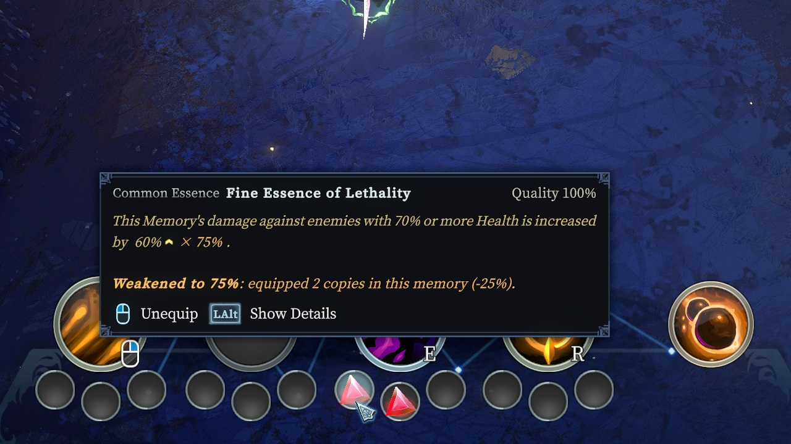
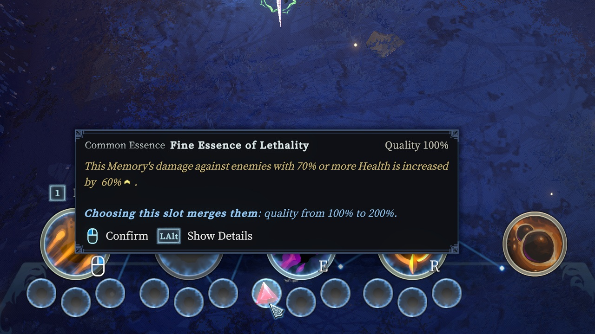
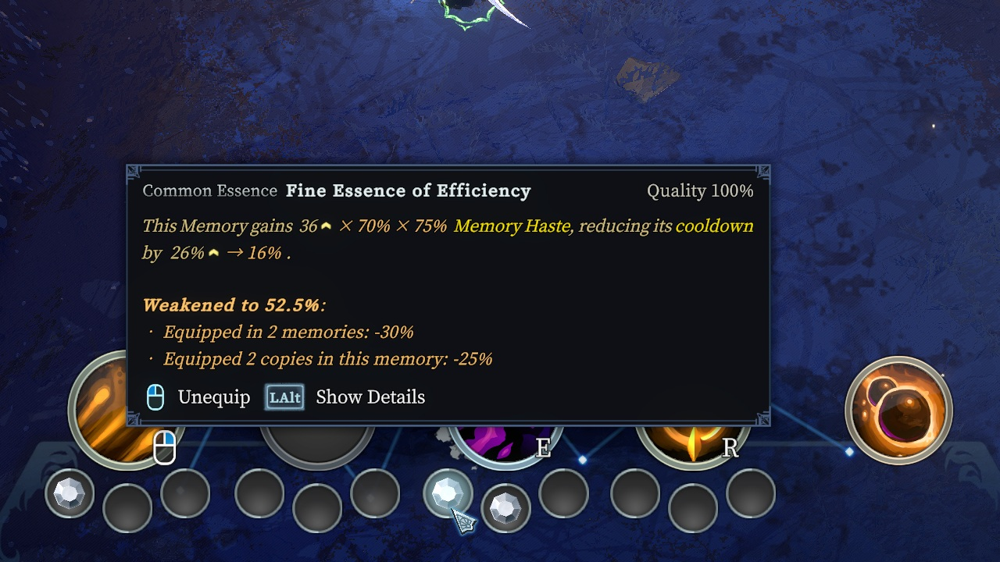

# ControlledMerge



Picking up an essence you already wear no longer merges it into the one you have. It goes to your
hand, and you choose a slot for it the way you would for any new essence: an empty slot keeps both,
and the slot of the one you have merges them. The same essence can then be worn more than once —
in two memories, or twice in one — and every copy is weaker for it.

## One of each, and where the game says so

The game allows one essence of a kind per hero and says so in exactly three places, all of them
through `HeroSkill.TryGetEquippedGemOfSameType`:

| where | what it does with a kind already worn |
| --- | --- |
| `Gem.OnInteract`, on the server | merges the one picked up into it (`HeroSkill.MergeGem`) instead of `HoldInHand` |
| `HeroSkill.EquipGem` | throws "Tried to equip more than one of same type of gem" |
| `UI_InGame_Interact_Gem.OnActivate` | shows *Combine* rather than *Equip* over the one on the ground |

Nothing else in `Dew.Core`, `Dew.Contents` or `Dew.UI` calls it (`HasGemOfType`, which `Dew.Contents`
uses once, asks by name and is left alone). So one prefix that answers "none worn" is the whole
of the change, and each of the three follows from it: the essence goes to the hand,
`HeroSkill.OnHoldingObjectChanged` starts `EditSkillManager.StartEquipGem` exactly as for a new
kind, the equip goes through, and the prompt says *Equip*.

`HeroSkill.CmdSwapSlotGem` needs it as well, and would be easy to miss: the server takes *both*
essences out and puts them back one at a time, so swapping two copies of a kind would throw on the
second `EquipGem` otherwise.

## Merging, as a choice

`HeroSkill.MergeGem` itself asks nothing about what is worn, only that the essence merged away is
not equipped and that the two are one type. So merging stays possible: with a new essence in hand,
choosing the slot of one of the same kind merges them, by the game's own rule
(`Gem.GetMergedQuality`, a plain sum at `GemMergeExponent` 1).

That click was taken because in the stock game it means something nobody wants: choosing an
occupied slot replaces what is in it and drops that on the ground, which for two of a kind only
throws the weaker one away.

**It is decided on the server, in the commands the click already sends.** In `EquipGem` mode
`EditSkillManager.DoClickOnGemSlot` sends `CmdUnequipGem` for the occupied slot, then
`CmdEquipGem` with the essence in hand. On the server, a prefix on the unequip command
(`UserCode_CmdUnequipGem_Internal`) sees the hero holding an essence of the slot's kind and merges
instead: it releases the held essence the way `EquipGem` does — the syncvar setter of
`holdingObject`, whose hook hands the essence back — and calls `MergeGem`, which destroys it and
raises `ClientEventManager.OnGemMergeUpgraded`, so the party display shows the upgrade as it always
did. A prefix on the equip command that follows lets it go quietly: its essence is gone (or, on the
host, whose click runs both commands at once, the hand was already empty and it is null), and the
stock command would throw and log it.

**So guests merge too, with or without the mod.** `MergeGem` is `[Server]` with no command in front
of it, and the first version merged on the clicking machine, in a prefix on `DoClickOnGemSlot` —
which only ever worked for the host. A guest's click replaced the copy, the copy dropped went back
to the hand when picked up (picking up no longer merges), and **a guest could not merge at all**.
The stock commands reach the server from anyone, and a party whose host has the mod now merges the
same way for everyone. Nothing new is sent: a custom Mirror message would disconnect a guest whose
host did not have the mod the first time it was sent.

The clicking machine draws the essence in hand into the slot when it sends the command
(`SetClientState_SetGemSlot`), and after a merge nothing about that slot changes on the server: the
same essence sits in it, with a higher quality. So the server sends the slot again as it is. Mirror's
`SyncDictionary` sends a set even for the same value, and the game redraws a slot on it
(`HeroSkill.OnGemChanged` → `OnLocalHeroGemChanged`), which puts the right essence back.

While an essence is in hand, the tooltip of a slot holding one of its kind says what choosing it
would do: *Choosing this slot merges them: quality from 140% to 170%.* A guest's tooltip says so as well,
once the host's settings have reached it (see **In co-op**).



**Two copies already worn merge by dragging one onto the other** in the edit screen. Every drag
from socket to socket ends in `HeroSkill.CmdSwapSlotGem`, and `HandleGemToGem` sends it as
`(target, source)`; DevTools' `/edit/drag` sends it in the same order. For two of a kind the stock
swap moves nothing worth moving, so a prefix on the server's command
(`UserCode_CmdSwapSlotGem_Internal`) merges the second into the first instead: the dragged copy is
taken off (`UnequipGem`, since `MergeGem` refuses an equipped victim) and merged into the one it was
dropped on, which stays in its socket and is sent again. The dragged copy's tooltip over that
socket carries the same merge line, and its weakening is the survivor's after the merge.

Checked in play, through the stock commands the click and the drag send: a 40% copy in hand clicked
onto a 100% one left one at 140%, nothing in hand and nothing on the ground; a 60% one dragged onto a
100% one left one at 160% and an empty socket; each slot drawn with the essence really in it. Two
essences of different kinds still swap.

## What is cut, and by how much

Two cuts, multiplied:

| | two | three or more |
| --- | --- | --- |
| memories holding the essence (every copy, everywhere) | −30% | −40% |
| copies in one memory (those copies) | −25% | −35% |

Two copies in Q and one in W leave each copy in Q at 0.7 × 0.75 = 52.5% and the one in W at 70%.
All four figures are settings.

**What is cut is every value of the essence that grows with its quality, and nothing else, once
per effect.** That is what merging raised, so it is what wearing a copy instead is paid in. A value grows with quality
when its `ScalingValue` has a per-level multiplier (`leveling` other than `NoScaling`) or a
per-level term (`lvlFactor`); a duration, a threshold or "reduced by 50% when applied to yourself"
is the same at every quality and stays the same here. It is the test the game's data dump makes
when it writes `basicAddedMultiplierPerLevel` beside a number, and the two agree: none of the 261
values the dump describes has a negative multiplier, so nothing that shrinks with quality is made
to grow by being cut.

Three values of `Gem` itself are left alone even when they scale — `cooldownTime`, `rateLimitTime`
and `rateLimitCount` — because they are when an essence may fire rather than what it does, and
cutting a cooldown would shorten it. Only one shipped essence scales one of them
(`Gem_C_Charcoal.rateLimitCount`).

A Debug build writes the list at load. At the time of writing: **103 essences, 59 of them with 75
scaling values of their own, and 47 of the instances they create with scaling values of theirs.**
Among them are counts, which the essences round with `RoundToInt`. `Gem_L_ChaosApple.castPerRoomCount`
and `Gem_L_DivineFaith.maxStacks` are cut; the counts that multiply a damage are left whole (below).
The smallest cut count starts at 2, and the deepest default cut (0.6 × 0.65) leaves 0.78 of it,
which still rounds to one; a setting far above the defaults can round one to nothing.

### Once per effect

Most essences with several values that grow do several things with them. Perfect grants six
stats, Twilight damages and heals, and each of those is cut once. Some multiply two of them into
one effect, and cutting both takes the factor twice. Scorched fires `maxCount` fireballs of
`dmgFactor` each. With both cut, a copy at 52.5% threw 2 fireballs of 8 where one alone throws 3 of
16: a third of the damage rather than a half. For those one value is left whole (`OneCut.cs`):

| Essence | Multiplied | Left whole |
|---|---|---|
| Scorched | fireballs per cast × damage of each | `maxCount` |
| Blade | blades per hit × damage of each | `baseCount` |
| Insight | enemies hit × damage to each | `maxHitCount` |
| Thunder | charge cap, which is bolts per cast, × damage of a bolt | `maxCharge` |
| Ricochet | chance to ricochet × share of the hit it carries | the chance (not in `QualityChances`) |
| Spiral | fireballs per second × damage of each | `shootSpeed` |
| Glaciate, Stillness | radius × damage | `Ai_*.scale` |
| Snow | barrier × damage of a snowball; snowballs come faster the larger the barrier | `Ai_Gem_R_Snow_Projectile.damage` |

The value left whole is the count, the reach, the chance or the rate, and the amount is cut. An
amount takes the factor exactly. A count is rounded (3 × 0.525 is 2, a cut of a third), and a chance
or a rate is bent by the curve it goes through.

Pairs that look alike and are left as they are:

- **A step and its cap** (Crucible, Night Sky, Omega). Both are cut, which leaves the number of
  steps where it was and the cap cut once.
- **Glacial Core and Glass.** Each multiplies its own heal by a conversion or an amplification that
  applies to *every* heal the hero takes (Glacial Core) or the memory makes (Glass). Left whole, the
  heals of everything else would pass through them uncut. Only their own heal takes the cut twice.

The values are recognised by content, as the firing limits are: a `ScalingValue` reaches the
patches as a struct, not as the field it came from. The audit checks that no other scaling value of
the essence or of what it creates has the same content.

## With AreMyGemsCompatible: only copies that fire count

Two copies of Essence of Lava, one in a memory that deals Fire damage and one in a memory that deals
none, are one working essence and one that does nothing - and without more, the working one was cut
by 30% for the company of the dead one. So when AreMyGemsCompatible is loaded, its verdict decides
what counts: a copy it marks as never firing where it sits is left out of both counts, and is not
cut itself, there being nothing of it to cut. The working Lava is then alone and whole, and the dead
one carries AreMyGemsCompatible's warning and no line of this mod's. The wording follows: *used in
2 memories*, *used 2 copies in this memory*, rather than *equipped*.

It is reached by reflection (`Fit`), as DevTools reaches it, so neither mod references the other.
Two things about finding it are not obvious. Every reload of the mods loads each assembly again
beside the old ones, and an old copy - or the copy of a mod since turned off - still defines
`Verdict`; so the one asked is the last loaded whose `AreMyGemsCompatibleMod.Live` is set, and
`Live` is checked again on every question. And a verdict can look through the room's modifiers,
while a value is read many times a frame, so an answer is kept for half a second per essence and
memory.

In co-op it is the host's AreMyGemsCompatible that decides what is cut, since the host computes every
value; a guest's decides only what its own tooltips say.

## The four ways a value reaches the game

**1. `Gem.GetValue(ScalingValue)`** — the essence's own code, and its properties built on it
(`Gem_C_Efficiency.reducedRatio`, `Gem_R_Epiphany.refundCooldownRatio`, `Gem_L_Culinary.DropChance`
…). A hyperbolic property is cut *before* its curve, which is where the value it is made from is
read.

**2. `AbilityInstance.GetValue(ScalingValue)`** — what the essence creates. Many essences hold
their numbers in a status effect or a projectile rather than in themselves: `Gem_C_Love` has no
`ScalingValue` at all, and the bonus it grants is `Se_Gem_C_Love.bonusAmount`, read with the effect's
own level, which was copied from the essence when it was made (`UpdateLevelIfNecessary`, or the
`skillLevel = effectiveLevel` in `Gem.Create*WithSource`).

Finding the essence an instance works for takes a walk, not the obvious property.
`AbilityInstance.gem` is the essence for an instance made through `Create*WithSource`, but its getter
falls back to `FindFirstOfType<Gem>`, writes that into a syncvar, and never looks at a parent's
`gem`. An instance made with `CreateStatusEffectWithSource(info.instance, …)` has the *memory's* cast
as its parent — that is the point of the helper — so whatever it makes in turn (Sharp's spawner's
arrows) has no essence anywhere above it, only a parent that knows one. So the walk reads each
instance's `Network_gem` on the way up and stops at a memory or an entity.

**3. `AbilityInstance.CreateDamage(type, ScalingValue, …)`** — the damage helpers
(`Damage`, `MagicDamage` …) hand the `ScalingValue` straight to `DamageData`'s constructor and never
pass through `GetValue`, so the result is cut with `ApplyRawMultiplier`. `DamageInstance` itself
goes through `GetValue(dmgFactor)` and the float overload, and is covered by (2) alone.

**4. Three essences that compute from quality without a `ScalingValue`.** `Gem_R_Abyss.atkEffectChance`
is `1 - 1/(1 + quality × k)`; the cut goes on the part inside,
recovered from the property's own answer as `x = c/(1 − c)` so the constants are not restated here.
`Gem_E_Virtuousness.addedChargeInt` is one charge plus one per `requiredQualityPerCharge`; the count
is cut and rounded down, never below the one it starts with. `Gem_E_Might.GetDamageAmpFallback` —
a guest's figure while the synced one is missing — reads its `ScalingValue` at its level directly.

What is not covered is `Se_Gem_U_SoulPrison_DeathInterrupt`, which heals `healPerQuality ×
quality` with a value that does not scale by itself. It is a unique essence and there is only ever
one.

### Numbers written down once

All four ways are read when the essence acts, except in the handful of essences that work their
number out once, when they are equipped, and keep it. `Gem_C_Efficiency` and `Gem_R_Lightweight`
put a `SkillBonus.cooldownMultiplier` on their memory, `Gem_L_Perfect` and `Gem_E_Might` fill their
`StatBonus`, and `Gem_E_Virtuousness` a `SkillBonus.addedCharge`. Each works it out again only in
`OnQualityChange`, since in the stock game quality is the one thing that changes it. The cut changes
it too, whenever a copy is put on, taken off or moved, and the copies already worn kept what they
had. Two Efficiency in one memory beside a third elsewhere gave the memory a cooldown 42% shorter,
while both tooltips promised 15.9% each, compounding to 29%. The first copy had kept its full 36
Ability Haste and the second the 27 it was worth when it arrived. Perfect with three copies gave
2.4 times its single value where the tooltips added up to 1.75.

`Refresh.cs` tells them. A few times a second the server compares each worn essence of such a kind
with the cut it last worked its numbers out with. When they differ, it runs the essence's
`OnQualityChange` with the quality it already has, which is the essence's own "my numbers changed".
`Gem.OnQualityChange` itself is skipped meanwhile: it lifts a merchant's cap on the sell price
(`maxSellGold`), flashes the socket and announces an upgrade, and none of that has happened. Twelve
shipped kinds override it, and every override only works the values out again. The exceptions are
`Gem_E_OurStory_Unfinished` and `Gem_U_GuidingCompass_NotCharged`, which turn into another essence
past a quality threshold; they are left out, and neither has a value the cut reaches.

`Gem_L_ChaosApple` also writes its number down, the casts per room of the memory it turns, but it
does so when it turns one, on entering a room. The number it takes is the one of that moment and
holds for the room, as a quality change mid-room would.

### Checked in game

On a Debug build, through DevTools (`ControlledMerge.Audit.Values`, which lists what an essence's
code reads right now, and the essence watch). Each essence was worn alone in W, then once in Q and
twice in W: factors 0.7 and 0.525. The tooltip, the value the code reads, and what happened in play
were compared.

| Kind of value | Essence | Tooltip, alone / Q / W | In play |
|---|---|---|---|
| Stat on the hero | Might | 270 / 189 / 142 | Max Health +270, then +472.5 = 189 + 2 × 141.75 |
| | Perfect | AD 6.3 / 4.41 / 3.31, the others alike | +11.025 AD, and Health, Attack Speed, Crit, Haste the same way |
| Memory haste, written down | Efficiency | 26% / 20% / 16% | cooldown ×0.7353, then Q ×0.7987 and W ×0.7074 = 0.841² |
| | Lightweight | 54 / 38 / 28 haste | Q ×0.7257, W ×0.607 = 0.779² |
| Memory haste, live | Direness, at 50% Health | 55% / 46% / 39% | Q ×0.5358, W ×0.3674 |
| | Paranoia, after damage | 60% / 51% / 44% | W ×0.4, then Q ×0.4878, W ×0.313 |
| A percentage amplifier | Lethality | 60% / 42% / 31% | Starfall's hit ×1.557 alone, ×1.645 with two copies in W (1 + 2 × 0.315) |
| A ratio | Blossom | 22% / 16% / 12% | heal per damage 0.1125 / 0.0791 / 0.0583, each half the ratio: the run halves healing |
| A barrier per hit | Rigidity | 9 / 6 / 5 | 8.75 / 6.13 / 3.21 (Starfall's proc coefficient takes 30% in W) |
| An effect's value | Wind | 33 / 23 / 17 (25 for two in one memory) | Haste +33; two in W: +24.75 |
| | Insatiable | 15% / 11% | Attack Damage +10.5% |
| An instance's damage | Sharp | 30 / 21 / 16 | per arrow ×0.700 and ×0.525 of alone |
| A count × an amount | Scorched | 3 fireballs throughout; damage 16 / 11 / 8 | 3 per cast from every copy; damage ×0.700 and ×0.524 |
| | Thunder | 7 charges throughout; damage 39 / 27 / 20 | 7 charges and 7 bolts from every copy; damage ×0.67 and ×0.55 (bolts vary) |
| | Blade, Insight, Spiral, Glaciate, Stillness | count, rate or radius unchanged; damage 82 / 57 / 43, 66 / 46 / 35, 30 / 21 / 16, 53 / 37 / 28, 66 / 46 / 35 | Blade's blow ×0.525 |
| | Snow | barrier 40 / 28 / 21; snowball 26 throughout | |
| Charges given to a memory | Virtuousness at 450% | 4 / 2 / 2 | charges +4, then Q +2 and W +4 |
| | Chaos Apple | 4 / 3 / 2 casts per room | a new memory with 4; then Q 3 (W: see below) |
| Cooldown given back | Momentum | 0.4 / 0.3 / 0.2 s (0.44 / 0.308 / 0.231 in the code) | 0.442 / 0.308 / 0.231 s per attack, both W copies on every attack |
| | Opportunity | 3 / 2.1 / 1.6 s | Dodge 3.009 / 2.1 / 3.151 (= 2 × 1.575) sooner |
| Own charges, to a cap | Omega | 110% / 77% / 58% after 20 stacks | 1.1 / 0.77 / 0.5775 after 20 s |
| | Divine Faith | 75 / 52 / 39 stacks | stopped at 75, and at 39 in W |
| | Crucible | 40% / 28% / 21% | 10 stacks in every copy: 40 / 28 / 21 |
| | Domination | 20% / 14% / 11% | stopped at 0.2 / 0.14 / 0.105 |
| | Night Sky | 20% / 14% / 10% | 20 / 14 / 10; Attack Speed +35% = 14 + 10.5 + 10.5 |
| Per stack | Solar Eye | 9 / 7 / 5 Burn | `CeilToInt` 9 / 7 / 5 |
| | Twilight, Eternal Flame, Embertail | cut | the value the code reads, cut the same |
| Quality curves | Abyss; Ricochet | 43% / 35% / 28%; Ricochet's chance 50% throughout, its share 90% / 63% / 47% | Abyss's property reads 0.4286 / 0.3443 / 0.2825. The tooltip is up to half a point higher, as in the stock game: `DewLocalization` sets `ScalingValue.levelOverride` while it evaluates a description, and `Gem.quality` answers with that level instead |
| Not cut | Charcoal's `rateLimitCount`, Talc's cooldown, Lightweight's damage penalty, Divine Faith's per-stack bonus, Omega's 20 stacks, Crucible's crit chance | unchanged | unchanged |

What was not measured in play: chances (Mortality 1.2 / 0.84 / 0.63%) and gold (Wealth), whose
effect is a roll or a drop; Charcoal, whose hits mix a plain and a Fire shard; and the constant
×1.98 between Sharp's tooltip and its arrows, which was the same at every factor and so is none of
the cut's. Those were checked through the tooltip and what the code reads.

- A second Wind at 40% into the Wind at 100%: one essence at 140%, the one picked up destroyed.
- Two `Gem_R_Slippery`, one taken off: the hero's `Se_Gem_R_Slippery` went with it and a new one
  appeared from the copy that stayed (see below).

## Copies amplifying the same hit

An essence that amplifies a memory's damage or healing marks the hit, so as not to amplify it twice:

```csharp
// Gem_C_Lethality.Amplify
if (... !data.IsAmountModifiedBy(this) ...) { data.ApplyAmplification(GetValue(dmgAmp)); data.SetAmountModifiedBy(this); }
```

25 of the shipped essences do the same — Confidence, Guidance, Lethality, Shatter, Sulfur, Talc,
Vengeance, Apathy, Inversion, Might, Omega, Overload, Predation, Umbra, Divine Faith, Embertail,
Heart of Gold, Suppressed Arcanum, Bleak, Contempt, Crucible, Glass, Lightweight, Slippery,
Eternal Flame. **The mark is kept by type**, not by essence: `DamageData._modifyFlags` is an
`ActorFlags`, which is a `List<Type>`, and `ActorFlags.Add(Actor)` adds `actor.GetType()`. The stock
game never has two of a type, so it makes no difference there. With copies it does. The first
Lethality in a memory marks the hit, and the second finds `Gem_C_Lethality` already there and
stands aside. Watched in a fight (DevTools' essence watch, below), three Lethality in one memory
fired 10, 0 and 0 times, and three Guidance fired 3, 0 and 0 times. Copies in *different* memories
were never affected: a hit passes only its own memory's processors.

`Stacking.cs` makes the mark mean what the call says, "this essence":

- Beside the type the game adds, the essence itself is kept in a table keyed by that very list, a
  `ConditionalWeakTable<List<Type>, List<Gem>>`.
- An essence asking whether the hit is marked is answered for itself.

Everything else is left alone:

- `FinalDamageData` and `FinalHealData` take the list by `ShallowCopy`, which is the same list and
  so the same entry.
- Damage made from another hit (`SetAmountOrigin`: a ricochet, a heal converted from damage) takes
  it by `DeepCopy`: a new list, with no entry. There the type alone answers, as in the stock game,
  so an amplifier that touched the original does not touch what came of it.
- A mark by `SetAmountModifiedBy(Type)`, or by anything that is not an essence, answers by type.

After the fix, three Lethality fired 10, 10 and 10 times, and three Guidance fired 3, 3 and 3 times.
The copies amplify one after another, each by its own value, already cut by the diminishing.

## Copies keep their own

The stock game never has two essences of a kind, so an essence finds what it made by its type or by
its owner, and that is exact. With copies it is one thing between them, and a copy works for
nothing. Watched in play, before the fix:

- two Wind in one memory gave the hero one `Se_Gem_C_Wind`, the second's. Wind destroys "the"
  `Se_Gem_C_Wind` before making its own, so a Wind in another memory took the first one's as well;
- two Chaos Apples in one memory turned it twice, the second keeping the first one's memory as the
  one to go back to, and left 3 casts per room where each promised 2;
- two Frost fired as one: the per-enemy cooldown is kept on the enemy, keyed by the hero;
- two Twilight: the first consumed the enemy's Darkness and the second found none.

`OwnState.cs` makes every copy keep its own, so copies add up, which is what two tooltips say. All
of it is the essences' own code, changed by transpiler. A helper that stands in for a lookup is handed
what the method runs on: the essence itself, a closure or coroutine it made (the essence is found in
its fields), or an instance it created (`Diminishing.SourceOf`).

| What was shared | Essences | Now |
|---|---|---|
| A buff on the hero, found by type | Wind, Quicksilver, Regeneration, Insatiable, Obsidian, Insight, Epiphany, Panic, Liberty, Composure, Apathy, Protection, Reflex, Hedgehog, Insensitivity, Aftershock (and its shockwave), Slippery, Soul Prison | `TryGetStatusEffect<T>` finds only an effect this essence made |
| A mark on the target, found by its caster (the hero) | Wound, Love, Fever | the predicate also asks that this essence made it |
| An effect found by name | Void, Dusk | the name carries the essence's `netId` |
| A cooldown per enemy, keyed by hero | Frost, Blade | kept per essence beside the game's table |
| Stacks the first copy consumes | Twilight (the enemy's Darkness), Purity (the hero's elements) | destroyed at the end of the frame; each copy counts them once |
| The memory Chaos Apple turns | Chaos Apple | only the first copy by socket turns it, with the casts per room of all the copies there |

Left shared on purpose:

- `Se_Gem_R_Frost_Stat`, Predation's and Culinary's stat bonuses: they gather what every copy adds;
- effects that are not the essence's own: Twilight's `Se_Elm_Dark`, Supersymmetry's one-shot
  protection;
- the Guiding Compass's curse on the heroes;
- Fangs' "the fourth attack is a critical strike": one critical strike is one. Each copy still fires
  its fangs on it.

A Debug build lists the essence methods it patched at load, since the targets are found by what the
code calls: 37 of them, beside the three that path 4 of the values patches and the two for Supersymmetry (below).

Checked in play, two copies each:

| Essence | Before | After |
|---|---|---|
| Wind (in one memory; in Q and W) | 1 buff | 2 buffs, Haste +49.5 = 2 × 24.75; 2 buffs |
| Insatiable, Liberty, Composure, Epiphany, Quicksilver, Protection, Hedgehog, Regeneration, Insensitivity, Insight, Panic, Reflex, Apathy, Slippery, Love | 1 effect | 2 effects; Attack Damage +22.5%, Critical Strike +45%, Ability Power +20.25 |
| Aftershock | 1 armor effect | 2 |
| Obsidian | 1 empowered attack | 2, both spent on one attack, 2 hits |
| Void, Dusk | one empowered attack | 2 explosions; 28 projectiles against 14 for one |
| Wound, Fever | 1 mark | 2 |
| Frost, Blade | second copy starved | 6 and 6, 15 and 15 triggers |
| Twilight | second copy finds no Darkness | 2 and 2 consumptions |
| Chaos Apple (two in W, 3 casts each) | 3 casts | turned once, 6 casts |

Purity, with Fire, Cold and Light put on the hero (`Actor.ApplyElemental` from a monster): one copy
healed 74.2 (3 × 49.5, halved by the run), two copies healed 111.4 (2 × 3 × 37.125, halved), each
counting all three.

## What copies do share: Supersymmetry

Supersymmetry sets the hero's Maximum Health to 1 and gives a barrier of its share of the Maximum
Health the hero had. Every copy adds a `FinalStats` processor that reads `data.maxHealth` as that
base and writes 1 over it, so the second copy's processor, running after the first's, read the 1.
It also remembers the share of Health the hero had, to give it back when taken off, and a copy put
on beside another found the hero at 1 of 1 and remembered all of it. Watched in play, a hero at 597
of 1193:

| | Before | After (`SharedEffects.cs`) |
|---|---|---|
| two copies: base, barrier | 1193 and 447; **1 and 0.4** | 1193 and 447 each, 895 in all |
| one taken off | | the other's barrier grows to its full 596 |
| both taken off | **1193 of 1193** | 597 of 1193 |

Every copy now takes the base the first processor of the pass saw, and a copy put on beside another
remembers what that one does. The one-shot protection it turns off is a counter in the game and
needed nothing.

## A copy taken off

Taking one copy off used to take a shared effect from the other as well, since the two found it by
type. So a copy that stayed was taken off the hero and put back, to make it again. With the effects
each copy's own (`OwnState.cs`) that is not needed, and it undid the staying copy's own state:
`OnUnequipGem` is where an essence lets go of what it gathered. A Thunder in W lost its 4 charges
when the Thunder in Q was taken off, and Composure its buff. It is gone. Now a copy taken off takes
only what is its own: two Thunder, one taken off, the other keeps its 4 charges; two Composure,
Liberty or Slippery, one taken off, keep one buff, the staying copy's.

## The tooltip

`DewLocalization.ConvertDescriptionNodesToText` writes an essence's description by evaluating the
fields it names: a `ScalingValue` is read off the essence and `GetValue` is called on it, and a
property such as `reducedRatio` is simply called, and calls `Gem.GetValue` itself. Cutting only in
play would leave the first kind at full value and the second cut, in one sentence.

So for the length of one `UI_Tooltip_GemDescription.DoInGameTooltip` the essence being described and its
factor are held, and every scaling value evaluated in that time is cut once, in a postfix on
`ScalingValue.GetValue(int, float, float, float, float, float)` — where both kinds end — while
`Gem.GetValue`'s own patch stands aside. A finalizer clears it if the description throws. The
description then says what the essence really does, and a line under it says why:

*Weakened to 70%: equipped in 2 memories (−30%).*

What is left in all carries its tenth when it has one — two copies in Q and one in W leave each in Q at
*52.5%*, which a whole number would have rounded to the even 52 — written with the language's own
decimal separator. The wording ("equipped in" or, when AreMyGemsCompatible decides which copies
count, "used in") follows the host's settings, like the numbers.

**It hooks `DoInGameTooltip`, not `OnSetup`, because AreMyGemsCompatible hooks `OnSetup`** —
and two mods on one method broke the other one's warning after any reload of the mods. Harmony
2.3.6 finds a patch method again by its module's MVID and token, taking the *first* loaded module
with that MVID (`HarmonyLib.Patch.PatchMethod`). A reload loads every mod's assembly again from
the same bytes, so the same MVID; when the second mod then patched `OnSetup`, Harmony rebuilt
AreMyGemsCompatible's patch against its oldest, dead copy, whose `Live` is null, and its line
silently stopped appearing. See **Two mods on one method** in [game-ui.md](game-ui.md).

The factor is the one for where the tooltip puts the essence: its own memory, or the memory it is
being dragged over — `currentObjects[0]` in `ShowGemEquipTooltip`'s layout, as AreMyGemsCompatible
reads it. Two copies of a kind trading places leave the loadout as it was, and are answered as such.

The line comes in three whole sentences per language rather than parts joined, and every count in
them is two or more; the copies are given as "copies here: N" in the languages whose plural would
change with the number. With both reasons it is a heading and a two-item list — one line with both
in it wrapped badly in a tooltip this narrow.

**A memory's tooltip lists its essences**, each with its description, through one
`UI_Tooltip_EquippedGemDescriber_Item.Setup(Gem, Hero)` per essence. Those are essences in their own
sockets, so each gets the same scope - its numbers are cut - but only a short note under it, *Weakened by diminishing returns.* The reasons are in the essence's own tooltip; several full lines in a list drowned the descriptions they were about.

**With the details key (Alt) held**, `DewLocalization.EvaluateAndRenderExpression` writes each number
as how it is made — the base, each stat's share, the level-scaling sprite — rather than its total.
Cut inside the scope, that formula would only show smaller numbers with nothing to say why. So in
that mode the number is rendered a second time with the cut held off (`Scope.Suppressed`, which
every cutting path honours), and the uncut formula is shown with each cut after it, in the order the line lists them:
*increased by 60%⌃ × 70% × 75%*. A number the cut does not reach renders the same both times and is left
alone.

**A number made from a cut value through a curve is shown as where it goes.** Efficiency's
*reducing its cooldown by 26%* is `1 − 1/(1 + haste/100)`: the haste is what is cut, and at 52.5% the
reduction is 16%, not 26% × 52.5% = 13.7% — which the formula above would have implied. Such a number
is told by the cut rendering not being the uncut one times the factor, to within the rounding both
were drawn with, and is shown as *26%⌃ → 16%* instead. The haste beside it stays
*36⌃ × 70% × 75%*. The same goes for every `reducedRatio` (Lightweight, Paranoia), Direness's
`maxReducedRatio`, Epiphany's `refundCooldownRatio` and Abyss's chance.



## In co-op

**The host decides.** Picking up (`Gem.OnInteract`'s server branch), equipping (`EquipGem` behind
`CmdEquipGem_Internal`) and every number an essence produces are the server's, so the rules are
whatever the host's copy says, and a party whose host has the mod plays by it whether or not the
guests do. A guest without it sees *Combine* over an essence it already wears, and full numbers in
its tooltips; picking it up still goes to the hand, because the host says so.

**A guest's copy goes by the host's settings.** The numbers an essence produces are computed by the
host's server, so a guest's tooltip has to show what the host's settings make of them: the four cuts,
whether merging is on, and whether dead copies are left out of the count (the host having
AreMyGemsCompatible loaded). `HostSettings.cs` sends them through `GameSettingsManager.customData`,
a `SyncDictionary<string, string>` the game already syncs to every client for game modes' own
settings (`GameMod_Limbo::depth`). A client without the mod stores the entry and never reads it, and
nothing new is sent. The entry is `1|30|40|25|35|1|1|<time>`: the format, the four cuts, merging,
leaving dead copies out, and `NetworkTime.time` at the moment of writing.

That time is there because the game keeps `customData` in the host's preferred settings
(`PlayLobbyManager`) and puts it back in the next lobby: an entry could outlive the mod, and a host
who removed it would go on announcing settings nothing enforces. So the host writes the entry again
every five seconds and whenever a setting changes, and a guest takes it only while it is under twenty
seconds old by Mirror's shared clock. With no entry, or a stale one, the host has no copy of the mod
running, lets nobody wear two of a kind, and a guest's tooltip cuts nothing.

A guest's own copy of AreMyGemsCompatible answers which copies are dead with the same data as the
host's; a guest without it, whose host has it, counts every copy and can show a copy cut that the
host counts as dead.

Merging, by choosing a slot or by dragging, is the server's and works for everyone in the party, and
with the host's settings in hand a guest's tooltip announces it as the host's does.

Checked with one machine: the entry as the host writes it, a guest's reading of it — taken fresh,
refused twenty seconds stale or malformed, other values read as sent — and a host setting changed
in play (two copies' cut from 25% to 50% and back), which the entry and the factor followed within
the frame.

Everything else the mod does to an essence's play runs where the essence's code runs, on the server:
the per-copy effects (`OwnState.cs`), the marks of `Stacking.cs`, the values written down once
(`Refresh.cs`, behind `NetworkServer.active`, for every hero in `ActorManager.allHeroes`), and
Supersymmetry's processor, which the game adds on the server alone. None of it sends anything the
game does not.
