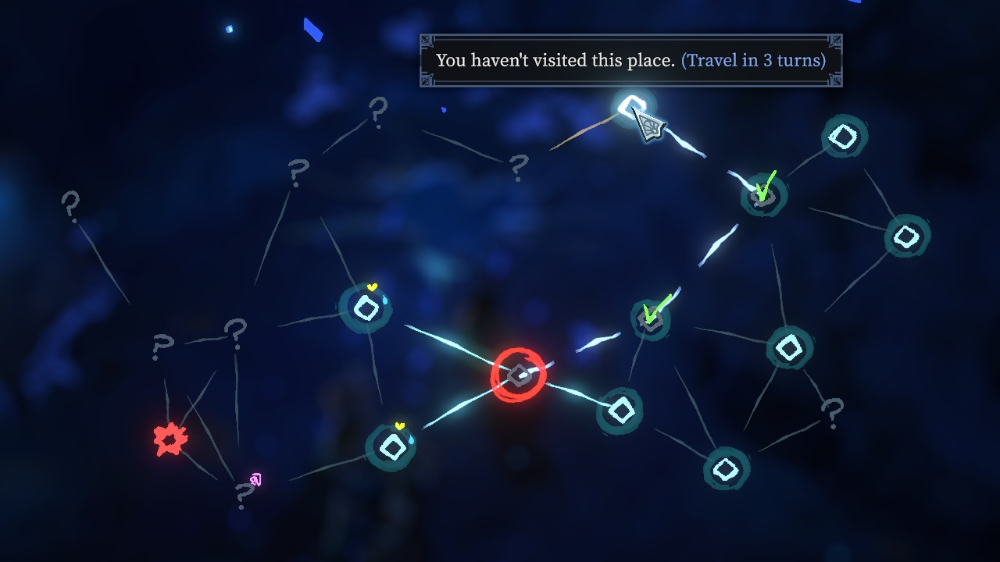
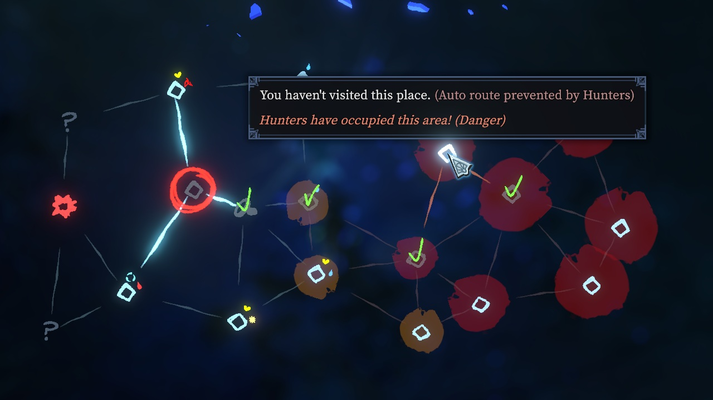
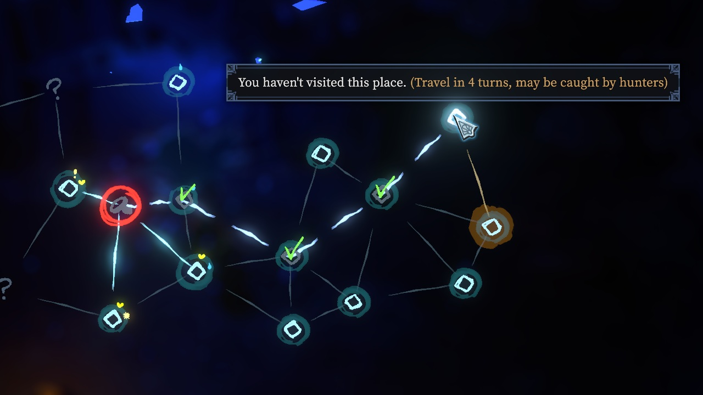

# MapAutoRoute

Hover a node the party cannot reach in one step and the map draws the way there through rooms
already cleared, how many turns it takes, and whether the hunt could reach it first. Click it and
the party walks it: every room in between counts as a turn, and only the last one is loaded.



*The whole mod in one frame: a node three rooms out, the way there through ground already cleared,
and the price of it before the click rather than after.*

Status: **ready to publish, not yet uploaded.** `1.0` in `about/metadata.json`, art and changelog in
place, named in `publish.ps1`. What is still open is at the bottom.

**It has no settings**, and that is a decision rather than an omission: the only one it ever had was
an on-off switch, which is what the mod list already is. `ModBehaviour` finds configs by reflection
— public instance fields whose type is a *subclass* of `ModConfig` — so with none declared,
`LoadConfigsToDisk` has nothing to do and `UI_ModManager` hides its settings button rather than
offering an empty window. Worth knowing if one is ever added: a field declared as `ModConfig`
itself, rather than as a subclass, fails that test and is silently never saved.

## The map is already a graph, and the game already holds it

Nothing here had to be derived. `ZoneManager` keeps `nodeDistanceMatrix`, an N×N `SyncList<int>`
filled during world generation, and `IsNodeConnected(a, b)` is nothing but *is the distance between
them 1*:

```csharp
public int GetNodeDistance(int a, int b) => nodeDistanceMatrix[nodes.Count * a + b];
public bool IsNodeConnected(int a, int b) => GetNodeDistance(a, b) == 1 || GetNodeDistance(b, a) == 1;
```

So adjacency is a table lookup, and a breadth-first search over it costs nothing worth measuring on
a zone of thirty-odd nodes. Two things about that matrix are worth keeping in mind:

- **It is read both ways round**, by the game's own code, so whatever asymmetry the generator can
  leave in it is real enough that both orders have to be asked.
- **The distance in it is not the distance this mod wants.** It counts steps through the whole
  graph, unvisited nodes included. A route may only pass through rooms already visited, which is a
  different graph and a different answer, so the search is run rather than the number read.

`NodeGraph` spells those two lines out rather than calling `IsNodeConnected`, which looks like
duplication and is not: **this mod patches that method.** A search that called it would be reading
its own answer back and would find every node one step from everywhere.

The rule the search enforces is one line:

```csharp
node.status == WorldNodeStatus.HasVisited && !node.IsSidetrackNode()
```

Two deliberate details. **The far end is exempt**: travelling to a revealed-but-unvisited node is
the ordinary move, and routing to one is that move with the rooms in between skipped — refusing it
would make the mod useless for the case it exists for. And **sidetrack nodes are excluded**, because
the map does not draw them either: `RefreshNodes` skips every node whose `IsSidetrackNode()` is
true, and a node the player cannot see is not one to route through.

## One idea: "adjacent" means more, briefly

The whole mechanism is a prefix on `ZoneManager.IsNodeConnected` that reports `true` for a
route-reachable node — **and a gate that is shut except inside two of the game's methods**.

```csharp
[HarmonyPatch(typeof(ZoneManager), nameof(ZoneManager.IsNodeConnected))]
private static bool Prefix(int __0, int __1, ref bool __result)
{
    if (!Widen.Allows(__0, __1)) return true;
    __result = true;
    return false;
}
```

The two it is opened for:

| Method | What it stops refusing |
| --- | --- |
| `UI_InGame_WorldMap.TravelToNode` | The click. Nothing is rewritten, so the index stays the node the player asked for. |
| `ZoneManager.UserCode_CmdTravelToNode…` | The command, on the server, where the check is repeated. |

Everything else then follows from the game's own code without being touched:

- The **hunter warning** is raised for the node actually being travelled to, because the index was
  never substituted for a nearer one.
- A **co-op vote** is held on that same node — `CmdTravelToNode` calls `StartVoteNextNode(player,
  index)` when `ShouldVoteOnTravel()`, and the mod is none the wiser.
- The **travel** is the game's ordinary one: `TravelToNode(index, advanceTurn: true, false, false)`.
  What that method does with a distant node is the next section.

**The scope is what keeps this honest.** `IsNodeConnected` has other callers, and one of them is
`RefreshNodes` — it is what decides *which edges the map draws*. Widened there, the map would grow
lines between rooms that are not connected at all. So the gate is opened in a prefix, shut in the
matching postfix, and shut again at the top of the mod's `Update` as a net under an exception thrown
past one.

The set of reachable nodes is computed *before* the gate is published, so nothing can observe it
half-open, and the search reads the matrix directly in any case.

### Travelling somewhere not adjacent is not an abuse of that method

`ZoneManager.TravelToNode` has no adjacency check of its own, and it is not an oversight — the game
calls it that way itself, every time a sidetrack ends:

```csharp
TravelToNode(sidetrackReturnNodeIndex, advanceTurn: false, isSidetrackTransition: true, skipInterrupts: true);
```

The node returned to is wherever the party left from, which is nowhere near the sidetrack. Those
arguments are also what tells that travel apart from a party walking somewhere: `advanceTurn: false`
and `isSidetrackTransition: true` both say "no rooms were crossed to get here", and the next
section leaves any travel saying so alone.

## The rooms in between are walked, not skipped

A travel is a room load plus a short sequence of world updates, and only the load is expensive.
The updates are the map moving on by one square, and this is all of them, from the routine behind
`ZoneManager.LoadNode`:

```csharp
currentTurnIndex++;
if (settings.newZone == null) AdvanceHunterTurn(false);
if (!isSidetrackTransition) UpdateModifiersByHunterStatus(settings.to);
SetCurrentNodeIndexAndRevealAdjacent(settings.to);
```

So a route replays that sequence once per room crossed and only loads the last one. **The hunt
advances a turn per room**, exactly as it would have if every room had been walked through. A
route is a way of not replaying rooms that are already cleared, not a way of outrunning what is
chasing you.

That replay is a prefix on `ZoneManager.TravelToNode` rather than on the command, for two reasons:
every path that decides a travel arrives at that method — a click, a co-op vote completing, an
event — so there is one place to be right; and by the time it is called every check the command
makes has passed, so nothing is replayed for a travel that then turns out to be refused. Once the
rooms before the last have been crossed, the destination is genuinely one step away, and the
original travel loads it with no help from the gate at all.

**The gate has to be shut before any of it runs, and that is not a precaution.** Both
`AdvanceHunterTurn` and `SetCurrentNodeIndexAndRevealAdjacent` ask `IsNodeConnected` what is next
to what. Left widened — and it is, because the replay runs inside the command that opened it — the
hunt would spread across the whole route in a single turn and the map would reveal itself along
with it.

Three things that are *not* skipped, because the game does them itself when the last room loads:
the sidetrack return index, the continue-save, and the room's own state. Only the crossing is
simulated.

## A hunter in the way stops the route



*Red is the hunt. There is a way to that node and the mod will not take it, which is a different
statement from "too far" and says so — under the game's own warning about where the pointer is.*

`hunterStatuses` is one status per node, and the values are not consecutive: `None = 0`,
`AboutToBeTaken = 1`, then `Level1 = 100`, `Level2 = 101`, `Level3 = 102`. The gap is load-bearing —
the game's own test for "there is a hunter here" is `get_isCurrentNodeHunted`, a comparison against
`Level1`, so a node only *about* to be taken does not count yet. The mod uses the same rule.

**A hunted room may not be routed through.** It is the third rule in `CanPassThrough`, alongside
"already visited" and "not a sidetrack", and the only one of the three that changes from turn to
turn. It applies to the rooms crossed and not to the far end: travelling *into* a hunted room is an
ordinary move the game allows, with a warning of its own, and refusing it would be the mod
overruling a decision that was never its to make.

So a destination whose only way there runs through the hunt is simply not reachable — the gate
refuses the click, the marker stays dark, no line is drawn, and the tooltip says why.

That leaves one case the search cannot rule out. **The hunt moves while the party walks**: a room
that is clear when they set off can be taken before they reach it, because every room crossed is a
turn. So the replay checks again before each step, and if a room has been taken in the meantime the
walk stops there and **the travel is redirected to it** — the party arrives and meets what is
waiting, rather than being simulated past it. That is the case the tooltip's "may be caught" is
about, and the only one left.

### It has to be on the host

Widening the client's own check only gets the command sent. The server checks again in
`UserCode_CmdTravelToNode`, and an unmodded host refuses it without a word — the click will simply
do nothing. Both ends need the mod; only the host strictly needs it.

## Drawing it with the game's own line

The map already draws a line between two nodes: `UI_InGame_World_Edge` carries five materials, and
`matTravel` is the dashed animated one used under a travel vote. The mod paints with that one, for
both things it has to say:

| What | When | Colour |
| --- | --- | --- |
| The route under the pointer | Hovering any node a route could reach | Blue, `#8ab4ff` |
| The route a vote is about | `isVoting && voteType == NextNode`, and the voted node is not adjacent | Red, the material as authored |

**The two colours say different things.** A route under the pointer is the mod's own answer to a
question the player is still asking. A route under a vote is the game's line — the party is
deciding where to go, which is the game's own moment — so `matTravel` is used exactly as authored
and the mod only extends it along the rooms in between. Nothing is written to `Graphic.color`
there either: `UpdateStatus` has already set it, white or the tint between two hunted nodes, and
that is the colour it should have.

Getting the blue took asking the running game a question.

The obvious way is `Graphic.color`: it is per instance, so it needs no material of the mod's own,
where `matTravel` is the game's and shared with the vote line on every other edge. It does nothing
visible. Materials live in addressable bundles rather than in the assemblies, so there is nothing
for a metadata reader to point at — the mod was made to describe the material to the player log the
first time it painted, and the answer was immediate:

```
material 'matEdgeTravel', shader 'AllIn1SpriteShader/AllIn1SpriteShaderUiMask (SoftMaskable)'
    _MainTex : Texture = none
    _Color   : Color   = RGBA(1.000, 0.235, 0.149, 1.000)
```

**There is no texture.** The line is `_Color` and nothing else, which is why a vertex tint had
nothing to tint. So the mod keeps one copy of `matTravel` with `_Color` written blue, made on first
use and destroyed on unload, and leaves the vertex colour white so the two cannot multiply into
something darker than either. If a game patch ever swaps the shader for one without `_Color`, the
vertex tint is still tried rather than nothing.

The second is not a flourish. **The game's vote line cannot draw itself once this mod is loaded**:
it paints the single edge between the party and `voteData`, and with the gate widened there may be
no such edge. The route stands in for it.

Two details came from reading `UpdateStatus`:

- **`_a` and `_b` have to be in travel order.** The line animates from `_a` towards `_b`, so an edge
  holding its ends the wrong way round animates back at the party. The game swaps the two fields
  itself for the vote line; the mod does the same swap for the same reason.
- **`onHoveringNodeChanged` is the only repaint signal there is.** Every edge subscribes to it in
  its `Setup`, and nothing else makes one re-evaluate. Moving the pointer raises it; a vote starting
  does not, so the mod raises it by hand for that. The game's `UpdateStatus(int, int)` ignores both
  arguments and reads `_parent.hoveringNode`, so what is passed does not matter — only that it is
  called.

The node marker gets the same treatment. `UI_InGame_World_NodeItem.Setup` lights `canTraverseObject`
for the immediate neighbours —

```csharp
canTraverseObject.SetActive(isWorldDisplayed == Shown && IsNodeConnected(current, index));
```

— with the gate shut, which is exactly the statement this mod makes untrue, so the same marker is
lit for anywhere a route reaches. That takes one search from the current node rather than one per
node, cached for a frame, since the map asks for it once per node while it rebuilds.

`OnEnable` calls `RefreshNodes`, so every opening of the map rebuilds every node and edge and runs
both painting patches. Nothing has to be invalidated when the map closes.

## The tooltip says how far, not that it cannot be done

`UI_Tooltip_WorldNode_Description` ends its first line with a red `(Too Far To Travel)` for anything
more than one step out:

```csharp
if (isWorldDisplayed == Shown && GetNodeDistance(currentNodeIndex, index) > 1)
    text.text += " <color=#caa>" + GetUIValue("InGame_Tooltip_WorldNode_TooFarToTravel") + "</color>";
```

**It measures with `GetNodeDistance`, not `IsNodeConnected`**, so the gate never reaches it — which
is just as well, since the honest replacement is not "you can go here" but how far away here is.
A postfix swaps that span for one of three things:

| Line | Colour | When |
| --- | --- | --- |
| `(Travel in N turns)` | blue | A route exists and the hunt cannot reach it in time |
| `(Travel in N turns, may be caught by hunters)` | amber | It can be walked, but not safely |
| `(Auto route prevented by Hunters)` | red | The hunt is sitting on the only way there |

N is the number of rooms the route crosses, and each of those rooms is a turn of the hunt.



*The middle case, and the one worth having: the way is clear now, and four turns is long enough
that the hunt on the right may not leave it that way.*

The third line needs two searches to be honest about. The first is the route the mod would take,
which goes around hunters; when it comes back empty the second asks the same question without that
rule. A way that exists but for the hunt is a refusal worth explaining. No way at all is not this
mod's business, and the game's own `(Too Far To Travel)` is left exactly where it is.

A warning that reads like the rest of the line is not a warning, which is why the three do not
share a colour.

**It says "may", and that is the strongest thing that can honestly be said.** How many rooms the
hunt takes in a turn is arithmetic and could be predicted:

```csharp
float pressure = isCurrentNodeHunted ? Mathf.Lerp(0.5f, 0.9f, currentHuntLevel / 5f) : 1f;
float chance   = Mathf.Clamp01(difficulty.hunterSpreadChance * pressure * hunterSpreadMultiplier);
credit += chance * candidates.Count;
while (credit >= 1 && candidates.Count > 0) { credit--; take the best-scoring candidate; }
```

*Which* rooms it takes is a scored pick with fuzziness in it, and cannot be. So the mod answers the
worst case rather than pretending to a probability: the front advances one node per turn at best,
and a room is at risk if the front could reach it by the turn the party would walk in — measured
with `GetNodeDistance`, since a hunter is not bound by where the party has already been. A hunt
that is switched off, or still sitting out its `hunterSkippedTurns`, moves nothing and warns
nothing.

The span is *rebuilt* rather than searched for. It is a concatenation of three things that can each
be asked for by name, and matching on the localized text alone would be a guess about which
language the player is reading it in. If the rebuilt string is not in the line — the node is one
step away, or the map is only open for looking at — nothing is touched.

N is the length of the route, which is not the same number as `GetNodeDistance` would give: that
counts steps through the whole graph, unvisited rooms included, and a route may only pass through
visited ones. It is also not the number of hunter turns the trip costs, which is one; see above.

## The three lines, in thirteen languages

`Localization.cs` carries the tooltip's three lines in every language the game ships data for —
one folder each under `RawData` — with `Shared.LanguageTable` doing the lookup, the same way
`AutoCast` does. There are no settings to translate beside them.

The mod's *description* is a separate matter and splits in two. `about/description.txt` is English
and can only be: `ModItem.description` is a single value and the mod format has no notion of
language, so the in-game manager shows one whatever the player's is ([building.md](building.md)).
The workshop page does take one per language, by hand, so `workshop/description.<lang>.txt` carries
`ru`, `zh-CN` and `zh-TW` — the same set the other two mods keep, with a changelog each to match
([changelog-format.md](changelog-format.md)).

Two decisions in there are worth keeping:

**The word for a hunter is the game's, not the mod's.** It was read out of the game's own content
rather than translated: `RawData/<lang>/achievements.json` holds `ACH_WHOS_THE_PREY_NOW`, whose
description names them, and the answers are not what a dictionary would have given — French says
*Traqueur* rather than *Chasseur*, Portuguese *Perseguidor*, Korean *추적자*, Polish *Tropiciel*. A
mod that invents its own word for something the game already names reads as one translated by
someone who had not played it.

**There is no singular form and there never needs to be.** The line only appears where the game has
already written "too far to travel", which it does when the distance is more than one — so a route
is at least two rooms, always. The languages whose plurals fork again at five, Russian and Polish,
are phrased so the number lands after a fixed genitive plural, which agrees with anything.

## What is still open

- **Gamepad.** The map has a whole cursor-and-snap input path (`OnGamepadConfirm`, `MoveSelection`)
  that has not been looked at. Confirming on a distant node should route the same way a click does.
- **A guest with an unmodded host gets silence.** The click does nothing and says nothing, where the
  game would at least have refused visibly. A message would be better manners.
- **Time under a real run.** Sidetracks, the dream-again loop, and co-op are the three places to
  look first. The co-op reasoning in [multiplayer.md](multiplayer.md) is read off the API rather
  than watched happening.
