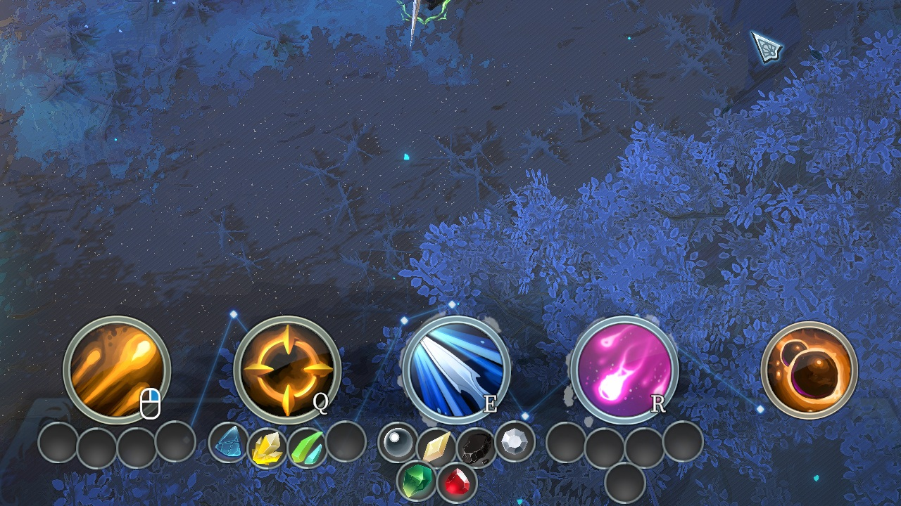
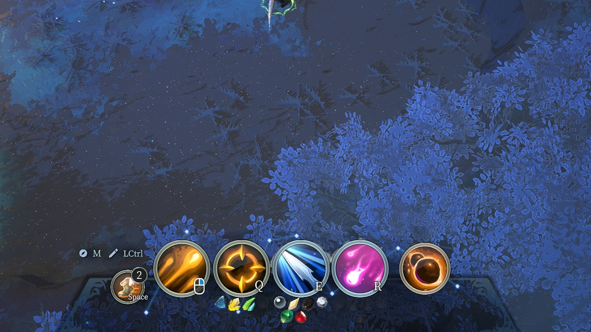
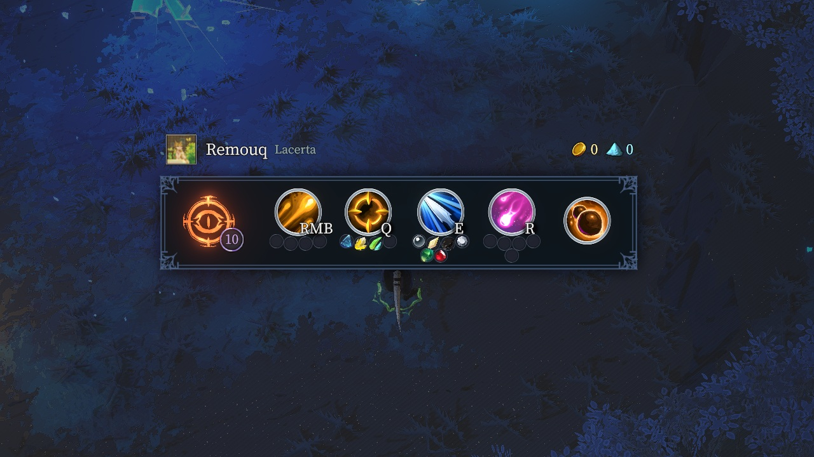

# MoreGemSlots



*Every slot the formula grants, drawn where the cell can hold it: four across, the rest on a
second row beneath.*

## The slot formula

```
base                                        3
hero level >= heroLevelForFirstSlot        +1   (10)
hero level >= heroLevelForSecondSlot       +1   (20)
memory +N  >= memoryUpgradesForFirstSlot   +1   (5)
memory +N  >= memoryUpgradesForSecondSlot  +1   (10)
                                       max  7
```

Seven is both the formula's maximum and exactly what the extended layout can draw — the two
numbers were made to line up. Hero level is `Entity.level`.

The memory thresholds count **upgrades, not levels**. A fresh memory is `SkillTrigger.level == 1`
and displays no `+`, so the number the player reads off it is `level - 1`. Comparing the threshold
against the level directly is off by one, and off by one in the direction that is hard to notice:
everything still works, it just triggers a level early.

Q/W/E/R are governed by the formula; Identity and Movement have no essence slots in the base
game and are left that way.

The four thresholds are the mod's entire config surface. Everything else — the base count, the
ceiling, the whole of the layout geometry — is a constant, because it is either derived from
those numbers or was settled by measurement and has no business being a knob.

## Losing slots

The count falls as well as rises: swap a levelled memory for a fresh one and its earned slots go
with it. `RehomeGems` runs before the count actually changes, moving each stranded essence to the
nearest free slot on the same memory, counting inwards from the edge so it travels as little as
possible. With nothing free it is left on the ground.

The move is `UnequipGem` then `EquipGem`, which is how the game's own slot swap does it — and the
order matters: `UnequipGem` puts the essence into the world first, so if the re-equip fails the
essence is on the floor rather than gone. That is what the `try`/`catch` around it is protecting.

## Getting past the essence slot ceiling

`UI_InGame_SkillButton_GemGroup` does not lay its essence slots out. It picks one of several
layouts drawn by hand in the prefab, indexed by `maxGemCount - 1`:

```csharp
for (int i = 0; i < groups.Length; i++)
    groups[i].SetActive(i == max - 1);
```

The game ships layouts for 1 to 4 (confirmed in game). At 5 no index matches, every layout is
switched off, and the slots disappear from the cell while still working underneath.



*The bug as the player meets it: the slot frames are gone from every cell, and the essences that
are still equipped sit in a heap under the bar.*

`GemLayoutPatch` is a Harmony prefix that replaces that method outright, for every count rather
than only above the ceiling. It owns the HUD; where the slots go is `GemArrangement`'s, shared with
the two summary screens described further down. Deferring to the original for small counts looked tidier and was
wrong: the original rebuilds its slot list *only in the frame it activates a layout*, and above
the ceiling the patch has already left that layout active — so dropping from five slots back to
four kept a five-entry list and drew five. Owning every count keeps the two from disagreeing.

**Seven is a hard ceiling.** The extended arrangement is a fixed four-over-three grid, so seven
is everything it can draw:

```
1 2 3 4
 5 6 7
```

`GemLayoutPatch.MaxSupportedSlots` is the single source of that number. `maxSlots` in the config
is clamped to it, and the periodic apply clamps the live `maxGemCount` down to it as well — so a
Corrupted Chaos shrine granting an extra slot on top of seven cannot push the count to eight and
make the slots vanish again.

Five and six take the **first positions of that same seven-slot grid** rather than being laid out
on their own. Laying each count out independently meant a slot moved every time the next one was
added, which read badly at six. `centerPartialBottomRow` switches back to per-count centring.

Every row is shaped by four numbers: `spread` (spacing relative to the authored step), `drop`
(distance from the skill cell), `curve` (1 follows the authored arc, 0 is a straight row) and
`rotate` (how much the widgets tilt along it). The bottom row adds `offset` for a sideways
shift, and `extraRowSpacing` sets the gap between the two rows — measured from the top row, so
moving that carries the bottom one with it.

Which set applies depends on the count:

| Count | Shaped by |
|---|---|
| 1, 2, 3 | `SmallShapes[1..3]` — a set each |
| 4 | the top-row constants |
| 5, 6, 7 | the top-row constants, plus the bottom-row ones for the extras |

Three separate sets for the small counts because the authored layouts have different geometry:
the same multiplier lands differently on a row of two than on a row of three, and one shared set
could not satisfy both. Four shares the top-row numbers deliberately — it doubles as the upper
half of the extended layout, so splitting them would let the two drift apart.

The extended rows end up nearly straight (`curve` 0.30, no tilt) because the authored arc reads
well at four slots but fans out at seven; the small layouts keep most of it (`curve` 0.75, full
tilt), having nothing to fan out into.

The saved settings live at
`%USERPROFILE%\AppData\LocalLow\Lizard Smoothie\Shape of Dreams\QuickSave\Mods\<mod id>\`.

The authored row's original positions and rotations are captured before anything is touched, so
they can be put back when the count drops. The authored rows are arcs, so the second row follows
a concentric arc at a smaller or larger radius depending on which way the original bulges; a
collinear layout falls back to a straight row. Row gap is `extraRowSpacing`, as a multiple of the
spacing between neighbouring slots.

Cloning the widget is what fixes both screens at once: the edit-skill overlay
(`UI_InGame_GemSlot_EditSkill`) is a companion component on the same object, not a second
layout, so it comes along with the clone.

**The gem group is a sibling of the skill button, not a child of it.** Both sides of that
pairing are resolved through the shared parent:

```csharp
// UI_InGame_SkillButton_GemGroup.Awake
_button = transform.parent.GetComponentInChildren<UI_InGame_SkillButton>();
// UI_InGame_SkillButton.Init
_gemGroup = transform.parent.GetComponentInChildren<UI_InGame_SkillButton_GemGroup>();
```

`GetComponentInParent<UI_InGame_SkillButton>()` from the gem group looks right and returns
`null`, which makes the patch quietly fall through to the original with no error anywhere. The
patch uses the same parent-then-children lookup the game does.

`slotIndex` is the whole identity of a slot widget — `thisSlotLocation` is
`(button.skillType, slotIndex)` and the group sorts by it — so setting it on each clone is what
makes the new slots address real gems. Clones are named `MoreGemSlots_Extra_<i>` and found again
by `GetComponentsInChildren(true)` on the next load, which is what stops a live reload from
stacking duplicates.

The array is only rebuilt when the count is actually wrong, since `LogicUpdate` runs every tick.

Turning the mod off while a run has more than four slots leaves those gems in the save but hides
the slots until it is turned back on, because the stock method has no layout for them.

## The other two screens that draw slots



*The scoreboard on Tab, laid out by the same code as the HUD and reading the same, on a row a
fraction of the size.*

The HUD is not the only place essence slots are drawn, and not the only place they stop being
drawn. The scoreboard on Tab (`UI_InGame_Scoreboard_PlayerItem_Skill`) and the end-of-run result
screen (`UI_InGame_Result_HeroSkillItem`) each keep a row per memory, and both cap out the same
way — the game's own field name says how many they were drawn for:

```csharp
public GameObject[] gemObjects234;
...
for (int i = 0; i < gemObjects234.Length; i++)
    gemObjects234[i].SetActive(max == i + 2);
```

Layouts for two, three and four. Above four nothing matches, every layout switches off, and the
row disappears — the ceiling bug again, one screen further out.

Neither screen is short of data. The scoreboard reads the live hero. The result screen reads
`DewGameResult`, and `GameResultManager.UpdateGameResult` records *every* entry of
`hero.Skill.gems` plus a `maxGemCount` per location — so slots five to seven are already in the
saved result and only the drawing was missing.

**The extended row is drawn from a container of the mod's own**, cloned from the four-slot layout
and parented beside it. That is not tidiness. The original switches every one of its layouts off
on each tick where the count is above four, so a patch that switched one back on would be undoing
that work sixty times a second — and each of those toggles re-runs `OnEnable` on every widget
under it. Owning the container lets the game's loop do exactly what it means to, which is clear
the native row, with nothing fighting over anything. It also means nothing of the game's is ever
moved, so unloading only has to destroy one object per row.

Cloning the container is safe for the result screen's score because every gem and skill item
returns 0 from `UpdateAndGetScore` — the items that actually score are the top-level result
panels, which are not children of a memory's gem row.

These are **postfixes**, unlike the HUD patch. The methods they hang off also fill in the skill
icon, the charge count and the key binding, none of which is worth reimplementing to change one
row. The trap that forced the HUD patch to own every count — the original rebuilding a cached slot
list only in the frame it activates a layout — has no counterpart here, because neither screen
caches anything and the gem widgets update themselves.

Two smaller things:

- The result screen's `UI_InGame_ResultView.Refresh` collects its items with
  `GetComponentsInChildren` on every call, so from the second refresh onwards it updates the added
  widgets by itself. Only the pass that creates them has to fill them in by hand, since it is
  running inside the enumeration that could not have seen them.
- The scoreboard's gem widget binds itself to whatever `index` it holds in `OnEnable`, which
  `Instantiate` runs before the real index can be assigned. Cycling the container re-runs it for
  every widget under it at once — the same trick as `AddClones` in `GemLayoutPatch`, one level up.

**All three screens share one arrangement**, in `GemArrangement`. They draw the same
four-over-three grid from the same constants, so a memory with six slots reads the same on the HUD,
on Tab and on the result screen. Laying the summary rows out on their own — which is what the first
version did, a single row squeezed to fit — is what made them look like a different mod's work.

The reason one set of constants can serve rows of wildly different sizes is that **every number in
`GemArrangement` is a multiple of the spacing measured off the authored row, never a distance**.
`spread`, `drop`, `curve` and the row gap are all relative, so the arrangement dialled in against
the HUD lands proportionally identical on a scoreboard entry a fraction of the size, with nothing
to re-tune. That property was already there — it just had a second caller to prove it.

`GemArrangement` knows nothing about gem slots. It takes the transforms of a row the game
authored, measures it, and puts however many transforms it is given back onto it, which is what
lets it serve three widget types sharing no base class beyond `Component`:

| What | HUD | Scoreboard | Result screen |
| --- | --- | --- | --- |
| widget | `UI_InGame_GemSlot` | `UI_InGame_Scoreboard_PlayerItem_Skill_Gem` | `UI_InGame_Result_HeroGemItem` |
| identity | `slotIndex` | `index` | `index` |
| patch | prefix, replaces | postfix | postfix |
| owns the container | the game's | its own clone | its own clone |

The arc fitting comes along for free. The HUD's authored rows are arcs and the summary screens draw
theirs flat, and the measuring step already told those apart and fell back to a straight line —
which is why the summary rows needed no special case.

**Every count is the mod's, not just the ones the game cannot draw** — otherwise a memory with
four slots is arranged one way on the HUD and another here, which is the inconsistency the shared
arrangement exists to remove. How that is done depends on what the original did on the tick, and
the two cases are worth naming:

| Count | What the original did | What the mod does |
| --- | --- | --- |
| 2–4 | activated `gemObjects234[max - 2]` | arranges the widgets in it **where they stand** |
| 5–7 | switched every layout off | draws its own container instead |

The first case works because **the original never moves the widgets inside a container** — it only
activates one. So they can be arranged in place, which is exactly what `GemLayoutPatch` does to the
HUD, and there is nothing to fight over. Each of those containers is measured on its own, because a
row authored for two has different geometry from one authored for three; that is the same reason
`SmallShapes` has a set per count.

The second case cannot work that way. There the original switches all of its layouts off on every
tick, so a patch that switched one back on would undo that sixty times a second, and each of those
toggles re-runs `OnEnable` on every widget below it. A container of the mod's own lets the original
do exactly what it means to.

**One measurement per container, shared by both cases**, and that is load-bearing rather than a
saving. The four-slot container is *both* the one arranged in place at four and the one the
extended row is measured from — so if each case measured for itself, opening Tab at four slots and
then gaining a fifth would measure a row this file had already spread, and apply the spread twice.
Measuring once, before anything is moved, is what keeps the two honest, and it makes the order the
two cases are first reached in stop mattering.

Because the game's own widgets are moved in the 2–4 case, unloading restores them —
`GemArrangement.Restore` per measured container, the same as the HUD patch has always done.

## A note on `UnpatchAll`

The stock template calls `harmony.UnpatchAll()` in `OnDestroy`. With no argument that removes
every Harmony patch in the process, including other mods'. `MoreGemSlots` passes
`harmony.UnpatchAll(harmony.Id)` so it only removes its own.

